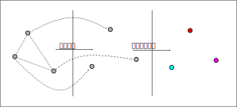
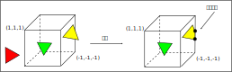

# 第2章 渲染流水线

渲染流水线的最终目的在于生成一张二维纹理，即在电脑屏幕上看到的所有效果。它的输入是一个虚拟摄像机、一些光源、一些shader以及纹理等。

## 2.1 综述

shader仅仅是渲染流水线中的一个环节。只有知道它在流水线中扮演怎样的角色，才能让shader发挥出作用。

### 2.1.1 什么是流水线

在工业上，流水线被广泛应用在装配线上。

举例来说，老王有一个生产洋娃娃的工厂，一个洋娃娃的生产流程分为4个步骤：1.制作躯干；2.缝上眼睛和嘴巴；3.添加头发；4.包装。

在流水线化之前，每个娃娃必须完成这4个工序才能开始制作下一个娃娃。如果每个步骤需要的时间是1个小时的话，那么每4个小时才能生产1个洋娃娃。

后来人们发现了一个更加有效的方法，即使用流水线。虽然制作一个洋娃仍然需要4个步骤，但是不需要从头到尾全部完成，而是每个步骤由专人来完成，所有步骤并行进行。也即工序1完成躯干的任务并转交给工序2时，工序1的工人又开始下一个洋娃娃的制作了。

使用流水线的好处在于，可以提高单位时间的生产量。图2.1显示了使用流水线前后生产效率的变化。

可以发现，流水线系统中决定最后生产速度的是最慢的工序所需的时间。例如，如果产生洋娃娃的第2道工序需要的是两个小时，其他工序仍然需要1个小时的话，那么平均每两个小时才能生产出一个洋娃娃。即工序2是性能瓶颈（bottleneck）。

理想情况下，如果把一个非流水线系统分成n个流水线阶段，且每个阶段耗费时间相同的话，会使整个系统得到n倍的速度提升。

### 2.1.2 什么是渲染流水线

上面关于流水线的概念同样适用于计算机的图像渲染中。渲染流水线的工作任务在于由一个三维场景出发、生成一张二维图像。换句话说，计算机需要从一系列的顶点数据、纹理等信息出发，把这些信息最终转换成一张人眼可以看到的图像。而这个工作通常是由CPU和GPU共同完成的。

《Real-Time Rendering, third edition》一书中将一个渲染流程分成3个阶段：应用阶段（Application stage）、几何阶段（Geometry stage）、光栅化阶段（Rasterizer stage）。

每个阶段本身通常也是一个流水线系统，即包含了子流水线阶段。见下图。

- 应用阶段

这个阶段是我们的应用主导的。通常由CPU负责实现。换句话说，应用开发者在这个阶段有绝对控制权。

在这个阶段，主要有3个任务：1. 准备好场景数据，例如摄像机的位置、视锥体、场景中包含了哪些模型、使用了哪些光源等；2. 为了提高渲染性能，需要做一个粗粒度剔除（culling）工作，把那些不可见的物体剔除出去；3. 设置每个模型的渲染状态。包括模型使用的材质、纹理、shader等。

这个阶段输出的是渲染所需的几何信息，即渲染图元（rendering primitives）。渲染图元可以是点、线、三角面等。

- 几何阶段

这一阶段通常在GPU上执行。

几何阶段负责和每个渲染图元打交道，进行逐顶点、逐多边形的操作。

几何阶段的一个重要任务就是把顶点坐标变换到屏幕空间中，再交给光栅器处理。

这一阶段的输出是屏幕空间的二维顶点坐标、每个顶点对应的深度值、着色等信息。

- 光栅化阶段

这一阶段产生屏幕上的像素，渲染出最终的图像。该阶段在GPU上执行。光栅化决定渲染图元中的哪些像素应该被绘制在屏幕上。它对输入的逐顶点数据（纹理坐标、顶点颜色等）进行插值，然后再进行逐像素处理。

## CPU和GPU之间的通信

应用阶段分为下面3个阶段：

1. 把数据加载到显存中；
2. 设置渲染状态；
3. 调用Draw Call；

### 2.2.1 把数据加载到显存中

渲染所需的数据需要从硬盘（Hard disk drive，HDD）中加载到系统内存（random access memory, RAM)中，然后网格和纹理等数据被加载到显卡上的存储空间——显存（video random access memory，VRAM）中。这是因为，显卡对于显存的访问速度更快，而且大多数显卡对于RAM没有直接的访问权利。见下图。

当把数据加载到显存中后，RAM中的数据就可以移除了。但对于一些数据来说，CPU仍然需要访问它们。比如CPU使用网格数据来进行碰撞检测，这时就不希望这些数据被移除，因为从硬盘加载到RAM的过程十分耗时。

### 2.2.2 设置渲染状态

状态定义了场景中的网格是怎样被渲染的。包括顶点着色器（vertex shader）、片元着色器（fragment shader）、光源属性、材质等。如果没有改变渲染状态，那么所有的网格都将使用同一种渲染状态。下图展示了当使用同一种渲染状态时，渲染3个不同网格的结果。

由于没有更改渲染状态，因此3个网格的外观看起来像是同一种材质的物体。

在准备好上述所有工作后，CPU就需要调用一个渲染命令来告诉GPU，可以按照设置来开始渲染。这个渲染命令就是Draw Call。

### 2.2.3 调用Draw Call

相信接触过渲染优化的读者应该都听说过Draw Call。实际上，Draw Call就是一个命令，它的发起方是CPU，接收方是GPU。这个命令仅仅会指向一个需要被渲染的图元（primitives）列表，而不会再包含任何材质信息——这是因为我们已经在上一个阶段中完成了。图2.5形象化地阐释了这个过程。

当给定一个Draw Call时，GPU就会根据渲染状态（例如材质、纹理、着色器等）和所有输入的顶点数据来进行计算，最终输出成屏幕上显示的那些漂亮的像素。而这个计算过程，就是我们下一节要讲的GPU流水线。

## 2.3 GPU流水线

当GPU从CPU那里得到渲染命令后，就会进行一系列流水操作，最终把图元渲染到屏幕上。

### 2.3.1 概述

在上一节中，我们解释了在应用阶段，CPU是如何和GPU通信，并通过调用Draw Call来命令GPU进行渲染。GPU渲染的过程就是GPU流水线。

对于概念阶段的后两个阶段，即几何阶段和光栅化阶段，开发者无法拥有绝对的控制权，其实现的载体是GPU。GPU通过实现流水线化，大大加快了渲染速度。虽然我们无法完全控制这两阶段的实现细节，但GPU向开发者开放了很多控制权。在这一节中，我们将具体了解GPU是如何实现这两个概念阶段的。

几何阶段和光栅化阶段可以分成若干更小的流水线阶段，这些流水线阶段由GPU来实现，每个阶段GPU提供了不同的可配置性或可编程性。图2.6中展示了不同的流水线阶段以及它们的可配置性或可编程性。

上图中的颜色表示了不同阶段的可配置性或可编程性。

- 绿色表示完全可编程；
- 黄色表示可以配置但不是可编程；
- 蓝色表示由GPU固定实现，开发者没有任何控制权。

绿色框的实线表示必须该Shader必须由开发者编程实现；绿色框的虚线表示该Shader是可选的。

从图中可以看出，GPU的渲染流水线接收顶点数据作为输入。这些顶点数据是由应用阶段加载到显存中，再由Draw Call指定的。这些数据随后被传递给顶点着色器。

顶点着色器（Vertex Shader）是完全可编程的，它通常用于实现顶点的空间变换、顶点着色等功能。曲面细分着色器（Tessellation Shader）是一个可选的着色器，它用于细分图元。几何着色器（Geometry Shader）同样是一个可选的着色器，它可以被用于执行逐图元（Per-primitive）的着色操作，或者被用于产生更多的图元。下一个流水线阶段是裁剪（Clipping），这一阶段的目的是将那些不在摄像机视墅内的顶点裁剪掉，并剔除某些三角图元的面片。这个阶段是可配置的。例如，我们可以使用自定义的裁剪平面来配置裁剪区域，也可以通过指令控制裁剪三角图元的正面还是背面。几何概念阶段的最后一个流水线阶段是屏幕映射（Screen Mapping）。这一阶段是不可配置和编程的，它负责把每个图元的坐标转换到屏幕坐标系中。

光栅化概念阶段中的三角形设置（Triangle Setup）和三角形遍历（Triangle Traversal）阶段也都是固定函数（Fixed-Function）的阶段。接下来的片元着色器（Fragment Shader），则是完全可编程的，它用于实现逐片元（per-frament）的着色操作。最后，逐片元操作（per-fragment operations）阶段负责执行很多重要的操作，例如修改颜色、深度缓冲、进行混合等，它不是可编程的，但具有很高的可配置性。

接下来，我们会对其中主要的流水线阶段进行更加详细的解释。

### 2.3.2 顶点着色器

顶点着色器是流水线的第一个阶段，它的输入来自于CPU。顶点着色器的处理单位是顶点，也就是说输入进来的每个顶点都会调用一次顶点着色器。顶点着色器本身不可创建或者销毁任何顶点，而且无法得到顶点与顶点之间的关 系。例如，我们无法得知两个顶点是否属于同一个三角网格。但正是因为这样的相互独立性，GPU可以利用本身的特性并行化处理每一个顶点，这意味着这一阶段的处理速度会很快。

顶点着色器需要完成的工作主要有：坐标变换和逐顶点光照。当然，除了这两个主要任务外，顶点着色器还可以输出后续阶段所需的数据。图2.7展示了在顶点着色器中对顶点位置进行坐标变换并计算顶点颜色的过程。

GPU在每个输入的网格顶点上都会调用顶点着色器。顶点着色器必须进行顶点的坐标变换，需要时还可以计算和输出顶点的颜色。例如，我们可以进行逐顶点的光照。

坐标变换，顾名思义，就是对顶点的坐标（即位置）进行某种变换。顶点着色器可以在这一步中改变顶点的位置，这在顶点动画中是非常有用的。例如，我们可以通过改变顶点位置来模拟水面、布料等。但需要注意的是，无论我们在顶点着色器中怎样改变顶点的位置，顶点着色器必须完成的工作是，把顶点坐标从模型空间转换到齐次裁剪空间。

`o.pos = mul(UNITY_MVP, v.position);`

上面这句代码的功能，就是把顶点坐标转换到齐次裁剪坐标系下，接着通常再由硬件做透视除法后，最终得到归一化的设备坐标（normalized device coordinates，NDC）。图2.8展示了这样的一个转换过程。

图2.8给出的坐标范围是OpenGL同时也是unity使用的NDC，它的z分量范围在[-1,1]之间，而在DirectX中，NDC的z分量范围是[0,1]。顶点着色器可以有不同的输出方式。最常见的输出路径是经光栅化后交给片元着色器进行处理。在现代的shader model中，它可以把数据发送给曲面细分着色器或几何着色器。

### 2.3.3 裁剪

由于场景可能会 很大，而摄像机的视野范围可能不会覆盖所有的物体，一个很自然的想法就是，那些不在摄像机视野范围的物体不需要被处理。裁剪（clipping）就是为了完成这个目的而被提出来的。

一个图元和摄像机视野的关系有3种：完全在视野内、部分在视野内、完全在视野外。完全在视野内的图片就继续传递给下一个流水线阶段，完全在视野外的图元不会继续向下传递，因为它们不需要被渲染。那些部分在视野内的图元需要进行一个处理，这就是裁剪。例如，一条线段的一个顶点在视野内，而另一个顶点不在视野内，那么在视野外部的顶点应该使用一个新的顶点来代替，这个新的顶点位于这条线段与视野边界的交点处。

由于已知顶点在NDC下的位置，因此裁剪就变得很简单，只需将图元裁 剪到单位立方体内。见图2.9.

只有单位立方体内的图元才需要被继续处理。因此，完全在单位立方体外部的红色三角形被舍弃，完全在单位立方体内部的绿色三角形将被保留。与单位立方体相交的黄色三角形会被裁剪，新的顶点会被生成，原来在外部的顶点会被舍弃。

这一步是不可编程的，我们无法通过编程来控制裁剪的过程，它是硬件上的固定操作。但是可以自定义一个裁剪操作来对这一步进行配置。
