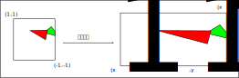
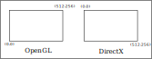

# 第2章 渲染流水线

渲染流水线的最终目的在于生成一张二维纹理，即在电脑屏幕上看到的所有效果。它的输入是一个虚拟摄像机、一些光源、一些shader以及纹理等。

## 2.1 综述

shader仅仅是渲染流水线中的一个环节。只有知道它在流水线中扮演怎样的角色，才能让shader发挥出作用。

### 2.1.1 什么是流水线

在工业上，流水线被广泛应用在装配线上。

举例来说，老王有一个生产洋娃娃的工厂，一个洋娃娃的生产流程分为4个步骤：1.制作躯干；2.缝上眼睛和嘴巴；3.添加头发；4.包装。

在流水线化之前，每个娃娃必须完成这4个工序才能开始制作下一个娃娃。如果每个步骤需要的时间是1个小时的话，那么每4个小时才能生产1个洋娃娃。

后来人们发现了一个更加有效的方法，即使用流水线。虽然制作一个洋娃仍然需要4个步骤，但是不需要从头到尾全部完成，而是每个步骤由专人来完成，所有步骤并行进行。也即工序1完成躯干的任务并转交给工序2时，工序1的工人又开始下一个洋娃娃的制作了。

使用流水线的好处在于，可以提高单位时间的生产量。图2.1显示了使用流水线前后生产效率的变化。

可以发现，流水线系统中决定最后生产速度的是最慢的工序所需的时间。例如，如果产生洋娃娃的第2道工序需要的是两个小时，其他工序仍然需要1个小时的话，那么平均每两个小时才能生产出一个洋娃娃。即工序2是性能瓶颈（bottleneck）。

理想情况下，如果把一个非流水线系统分成n个流水线阶段，且每个阶段耗费时间相同的话，会使整个系统得到n倍的速度提升。

### 2.1.2 什么是渲染流水线

上面关于流水线的概念同样适用于计算机的图像渲染中。渲染流水线的工作任务在于由一个三维场景出发、生成一张二维图像。换句话说，计算机需要从一系列的顶点数据、纹理等信息出发，把这些信息最终转换成一张人眼可以看到的图像。而这个工作通常是由CPU和GPU共同完成的。

《Real-Time Rendering, third edition》一书中将一个渲染流程分成3个阶段：应用阶段（Application stage）、几何阶段（Geometry stage）、光栅化阶段（Rasterizer stage）。

每个阶段本身通常也是一个流水线系统，即包含了子流水线阶段。见下图。

- 应用阶段

这个阶段是我们的应用主导的。通常由CPU负责实现。换句话说，应用开发者在这个阶段有绝对控制权。

在这个阶段，主要有3个任务：1. 准备好场景数据，例如摄像机的位置、视锥体、场景中包含了哪些模型、使用了哪些光源等；2. 为了提高渲染性能，需要做一个粗粒度剔除（culling）工作，把那些不可见的物体剔除出去；3. 设置每个模型的渲染状态。包括模型使用的材质、纹理、shader等。

这个阶段输出的是渲染所需的几何信息，即渲染图元（rendering primitives）。渲染图元可以是点、线、三角面等。

- 几何阶段

这一阶段通常在GPU上执行。

几何阶段负责和每个渲染图元打交道，进行逐顶点、逐多边形的操作。

几何阶段的一个重要任务就是把顶点坐标变换到屏幕空间中，再交给光栅器处理。

这一阶段的输出是屏幕空间的二维顶点坐标、每个顶点对应的深度值、着色等信息。

- 光栅化阶段

这一阶段产生屏幕上的像素，渲染出最终的图像。该阶段在GPU上执行。光栅化决定渲染图元中的哪些像素应该被绘制在屏幕上。它对输入的逐顶点数据（纹理坐标、顶点颜色等）进行插值，然后再进行逐像素处理。

## CPU和GPU之间的通信

应用阶段分为下面3个阶段：

1. 把数据加载到显存中；
2. 设置渲染状态；
3. 调用Draw Call；

### 2.2.1 把数据加载到显存中

渲染所需的数据需要从硬盘（Hard disk drive，HDD）中加载到系统内存（random access memory, RAM)中，然后网格和纹理等数据被加载到显卡上的存储空间——显存（video random access memory，VRAM）中。这是因为，显卡对于显存的访问速度更快，而且大多数显卡对于RAM没有直接的访问权利。见下图。

当把数据加载到显存中后，RAM中的数据就可以移除了。但对于一些数据来说，CPU仍然需要访问它们。比如CPU使用网格数据来进行碰撞检测，这时就不希望这些数据被移除，因为从硬盘加载到RAM的过程十分耗时。

### 2.2.2 设置渲染状态

状态定义了场景中的网格是怎样被渲染的。包括顶点着色器（vertex shader）、片元着色器（fragment shader）、光源属性、材质等。如果没有改变渲染状态，那么所有的网格都将使用同一种渲染状态。下图展示了当使用同一种渲染状态时，渲染3个不同网格的结果。

由于没有更改渲染状态，因此3个网格的外观看起来像是同一种材质的物体。

在准备好上述所有工作后，CPU就需要调用一个渲染命令来告诉GPU，可以按照设置来开始渲染。这个渲染命令就是Draw Call。

### 2.2.3 调用Draw Call

相信接触过渲染优化的读者应该都听说过Draw Call。实际上，Draw Call就是一个命令，它的发起方是CPU，接收方是GPU。这个命令仅仅会指向一个需要被渲染的图元（primitives）列表，而不会再包含任何材质信息——这是因为我们已经在上一个阶段中完成了。图2.5形象化地阐释了这个过程。

当给定一个Draw Call时，GPU就会根据渲染状态（例如材质、纹理、着色器等）和所有输入的顶点数据来进行计算，最终输出成屏幕上显示的那些漂亮的像素。而这个计算过程，就是我们下一节要讲的GPU流水线。

## 2.3 GPU流水线

当GPU从CPU那里得到渲染命令后，就会进行一系列流水操作，最终把图元渲染到屏幕上。

### 2.3.1 概述

在上一节中，我们解释了在应用阶段，CPU是如何和GPU通信，并通过调用Draw Call来命令GPU进行渲染。GPU渲染的过程就是GPU流水线。

对于概念阶段的后两个阶段，即几何阶段和光栅化阶段，开发者无法拥有绝对的控制权，其实现的载体是GPU。GPU通过实现流水线化，大大加快了渲染速度。虽然我们无法完全控制这两阶段的实现细节，但GPU向开发者开放了很多控制权。在这一节中，我们将具体了解GPU是如何实现这两个概念阶段的。

几何阶段和光栅化阶段可以分成若干更小的流水线阶段，这些流水线阶段由GPU来实现，每个阶段GPU提供了不同的可配置性或可编程性。图2.6中展示了不同的流水线阶段以及它们的可配置性或可编程性。

上图中的颜色表示了不同阶段的可配置性或可编程性。

- 绿色表示完全可编程；
- 黄色表示可以配置但不是可编程；
- 蓝色表示由GPU固定实现，开发者没有任何控制权。

绿色框的实线表示必须该Shader必须由开发者编程实现；绿色框的虚线表示该Shader是可选的。

从图中可以看出，GPU的渲染流水线接收顶点数据作为输入。这些顶点数据是由应用阶段加载到显存中，再由Draw Call指定的。这些数据随后被传递给顶点着色器。

顶点着色器（Vertex Shader）是完全可编程的，它通常用于实现顶点的空间变换、顶点着色等功能。曲面细分着色器（Tessellation Shader）是一个可选的着色器，它用于细分图元。几何着色器（Geometry Shader）同样是一个可选的着色器，它可以被用于执行逐图元（Per-primitive）的着色操作，或者被用于产生更多的图元。下一个流水线阶段是裁剪（Clipping），这一阶段的目的是将那些不在摄像机视墅内的顶点裁剪掉，并剔除某些三角图元的面片。这个阶段是可配置的。例如，我们可以使用自定义的裁剪平面来配置裁剪区域，也可以通过指令控制裁剪三角图元的正面还是背面。几何概念阶段的最后一个流水线阶段是屏幕映射（Screen Mapping）。这一阶段是不可配置和编程的，它负责把每个图元的坐标转换到屏幕坐标系中。

光栅化概念阶段中的三角形设置（Triangle Setup）和三角形遍历（Triangle Traversal）阶段也都是固定函数（Fixed-Function）的阶段。接下来的片元着色器（Fragment Shader），则是完全可编程的，它用于实现逐片元（per-frament）的着色操作。最后，逐片元操作（per-fragment operations）阶段负责执行很多重要的操作，例如修改颜色、深度缓冲、进行混合等，它不是可编程的，但具有很高的可配置性。

接下来，我们会对其中主要的流水线阶段进行更加详细的解释。

### 2.3.2 顶点着色器

顶点着色器是流水线的第一个阶段，它的输入来自于CPU。顶点着色器的处理单位是顶点，也就是说输入进来的每个顶点都会调用一次顶点着色器。顶点着色器本身不可创建或者销毁任何顶点，而且无法得到顶点与顶点之间的关 系。例如，我们无法得知两个顶点是否属于同一个三角网格。但正是因为这样的相互独立性，GPU可以利用本身的特性并行化处理每一个顶点，这意味着这一阶段的处理速度会很快。

顶点着色器需要完成的工作主要有：坐标变换和逐顶点光照。当然，除了这两个主要任务外，顶点着色器还可以输出后续阶段所需的数据。图2.7展示了在顶点着色器中对顶点位置进行坐标变换并计算顶点颜色的过程。

GPU在每个输入的网格顶点上都会调用顶点着色器。顶点着色器必须进行顶点的坐标变换，需要时还可以计算和输出顶点的颜色。例如，我们可以进行逐顶点的光照。

坐标变换，顾名思义，就是对顶点的坐标（即位置）进行某种变换。顶点着色器可以在这一步中改变顶点的位置，这在顶点动画中是非常有用的。例如，我们可以通过改变顶点位置来模拟水面、布料等。但需要注意的是，无论我们在顶点着色器中怎样改变顶点的位置，顶点着色器必须完成的工作是，把顶点坐标从模型空间转换到齐次裁剪空间。

`o.pos = mul(UNITY_MVP, v.position);`

上面这句代码的功能，就是把顶点坐标转换到齐次裁剪坐标系下，接着通常再由硬件做透视除法后，最终得到归一化的设备坐标（normalized device coordinates，NDC）。图2.8展示了这样的一个转换过程。

图2.8给出的坐标范围是OpenGL同时也是unity使用的NDC，它的z分量范围在[-1,1]之间，而在DirectX中，NDC的z分量范围是[0,1]。顶点着色器可以有不同的输出方式。最常见的输出路径是经光栅化后交给片元着色器进行处理。在现代的shader model中，它可以把数据发送给曲面细分着色器或几何着色器。

### 2.3.3 裁剪

由于场景可能会 很大，而摄像机的视野范围可能不会覆盖所有的物体，一个很自然的想法就是，那些不在摄像机视野范围的物体不需要被处理。裁剪（clipping）就是为了完成这个目的而被提出来的。

一个图元和摄像机视野的关系有3种：完全在视野内、部分在视野内、完全在视野外。完全在视野内的图片就继续传递给下一个流水线阶段，完全在视野外的图元不会继续向下传递，因为它们不需要被渲染。那些部分在视野内的图元需要进行一个处理，这就是裁剪。例如，一条线段的一个顶点在视野内，而另一个顶点不在视野内，那么在视野外部的顶点应该使用一个新的顶点来代替，这个新的顶点位于这条线段与视野边界的交点处。

由于已知顶点在NDC下的位置，因此裁剪就变得很简单，只需将图元裁 剪到单位立方体内。见图2.9.

只有单位立方体内的图元才需要被继续处理。因此，完全在单位立方体外部的红色三角形被舍弃，完全在单位立方体内部的绿色三角形将被保留。与单位立方体相交的黄色三角形会被裁剪，新的顶点会被生成，原来在外部的顶点会被舍弃。

这一步是不可编程的，我们无法通过编程来控制裁剪的过程，它是硬件上的固定操作。但是可以自定义一个裁剪操作来对这一步进行配置。

### 2.3.4 屏幕映射

这一步输入的坐标仍然是三维坐标系下的坐标（范围在单位立方体内）。屏幕映射（screen mapping）的任务是把每个图元的x和y坐标转换到屏幕坐标系（screen coordinates）下。屏幕坐标是一个二维坐标系，它和我们用于显示画面的分辨率有很大关系。

假设，需要把场景渲染到一个窗口上，窗口的范围是从最小的窗口坐标$(x_1,y_1)$到最大的窗口坐标$(x_2,y_2)$，其中$x_1 < x_2 且 y_1 < y_2$。由于我们输入的坐标范围在-1到1，因此可以想象到，这个过程实际是一个缩放的过程，如图2.10所示。屏幕映射不会对输入的z坐标做任何处理。屏幕坐标系和z坐标一起构成了一个坐标系，叫做窗口坐标系（window coordinates）。这些值会一起被传递到光栅化阶段。

屏幕映射将x、y坐标从(-1,1)范围转换到屏幕坐标系中。

屏幕映射得到的屏幕坐标决定了这个顶点对应屏幕上哪个像素以及距离这个像素有多远。

屏幕坐标系在OpenGL与DirectX之间有差异。OpenGL把屏幕的左下角当成最小的窗口坐标值，而DirectX把屏幕的左上角当成最小的窗口坐标值。如图2.11所示。

OpenGL和DirectX的屏幕坐标系差异。对于一张512*256大小的图像，在OpenGL中其（0，0）点在左下角，而在DirectX中其（0,0）点在左上角。

产生这种差异的原因是，微软的窗口都使用了这样的坐标系统，这与书籍的阅读方式一致，都是从左到右，从上到下。并且很多图像文件也是按照这样的整式进行存储的。

如果发现图像是倒转的，那么很有可能就是这个原因造成的。

### 2.3.5 三角形设置

这是广栅化阶段的第一步。上一个阶段输出的信息是屏幕坐标系下的顶点位置以及和它们相关的额外信息，如深度值（z坐标）、法线方向、视角方向等。光栅化阶段有两个最重要的目标：计算每个图元覆盖了哪些像素，以及为这些像素计算它们的颜色。

光栅化的第一个流水线阶段是三角形设置（triangle setup）。这个阶段会计算光栅化一个三角网格所需的信息。具体来说，上一个阶段输出的都是三角网格的顶点，即我们得到的是三角网格每条边的两个端点。如果要得到整个三角网格对象素的覆盖情况，需要计算每条边上的像素坐标。为了计算边界像素的坐标信息，需要得到三角形边界的表示方式。这样一个计算三角网格表示数据的过程就叫做三角形设置。

### 2.3.6 三角形遍历

三角形遍历（triangle traversal）阶段将会检查每个像素是否被一个三角网格所覆盖。如果被覆盖的话，就会生成一个片元（fragment）。而这样一个找到哪些像素被三角网格覆盖的过程就是三角形遍历，这个阶段也被称为扫描变换（scan conversion）。

此阶段会根据上一阶段的计算结果来判断一个三角网格覆盖了哪些像素，并使用三角网格3个顶点的顶点信息对整个覆盖区域的像素进行插值。图2.12展示了些阶段的简化计算过程。

根据几何阶段输出的顶点信息，最终得到该三角网格覆盖的像素位置。对应像素会生成一个片元，而片元中的状态是对3个顶点的信息进行插值得到的。例如，对图2.12中3个顶点的深度进行插值得到其重心位置对应的片元的深度值为-10.0。

此步骤的输出为一个片元序列。片元并不是像素，而是包含了很多状态的集合，这些状态用于计算每个像素的最终颜色。这些状态包括但不限于屏幕坐标、深度信息，以及其他从几何阶段输出的顶点信息（法线、纹理坐标等）。

### 2.3.7 片元着色器

片元着色器（Fragment Shader）是另一个非常重要的阶段。在DirectX中，被称为像素着色器（Pixel Shader），但片元是更合适的名字，因为此时它并不是一个真正意义上的像素。

前面光栅化阶段不会影响屏幕上的每个像素的颜色值，而是产生用来描述如何覆盖像素的三角网格这样的数据信息。每个片元就负责存储这样一些数据。真正会对像素产生影响的是后面的逐片元操作（Per-Fragment Operation）。

片元着色器的输入是顶点着色器输出的数据插值得到。片元着色器的输出是一个或者多个颜色值。

根据上一步插值后的片元信息，片元着色器计算出该片元的输出颜色。

片元着色器有局限性，它仅可以影响单个片元。即，当执行片元着色器时，它不能将任何计算结果发送给它的邻居们。

### 2.3.8 逐片元操作

逐片元操作（Per-Fragment Operation）是OpenGL中的说法，在DirectX中，这一阶段被称为输出合并阶段（Output-Merger）。这一步骤的目的就是合并。OpenGL中的名字指出了这个阶段的操作单位。

1. 决定每个片元的可见性。例如模板测试、深度测试等；
2. 对于通过所有测试的片元，把它的颜色值和已经存储在颜色缓冲区中的颜色进行混合。

此阶段所做的操作。只通过了所有的测试后，片元才能和颜色缓冲区中已存在的像素颜色进行混合，并写入颜色缓冲区中。

下面举例两个最基本的测试：深度测试和模板测试。

简化的模板测试流程

简化的深度测试流程图

模板缓冲（stencil buffer）与颜色缓冲、深度缓冲是一类东西。如果开启了模板测试，GPU会首先使用读取掩码读取模板缓冲区中该片元位置的模板值，然后将该值和读取到的参考值进行比较，这个比较函数可以由开发者指定。不管一个片元有没有通过模板测试，都可以根据模板测试和下一步的深度测试结果来修改模板缓冲区，这个修改操作也是由开发者指定的。开发者可以设置不同结果下的修改操作，例如，在失败时模板缓冲区保持不变，通过时将模板缓冲区中对应位置的值加1等。模板测试通常用于限制渲染的区域。另外，模板测试还有一些更高级的用法，如渲染阴影、轮廓渲染等。

如果一个片元通过了模板测试，那么它会进行下一个测试——深度测试（depth test）。深度测试是高度可配置的。如果开启了深度测试，GPU会把该片元的深度值与已经存在于深度缓冲区中的深度值进行比较。这个比较函数可以由开发者设置。通常这个比较函数是小于等于的关系，即如果这个片元的深度值大于等于当前深度缓冲区中的值，那么就舍弃它。这是因为，通常只想显示出离摄像机最近的物体，而那些被其他物体遮挡的就不需要出现在屏幕上。如果这个片元没有通过深度测试，那么它就会被舍弃。

深度测试与模板测试的差异，在于如果一个片元没有通过深度测试，它就没有权利更改深度缓冲区中的值。如果它通过了深度测试，开发者可以指定是否要使用这个片元的深度值覆盖掉原有的深度值，这是通过开启、关闭深度写入来做到的。透明效果和深度测试以及深度写入的关系非常密切。

如果一个片元通过模板测试以及深度测试，那么它将会经历合并步骤。

由于渲染过程是一个物体接着一个物体画到屏幕上的。而每个像素的颜色信息被存储在颜色缓冲区中。因此当执行这次渲染时，颜色缓冲区中往往已经有了上次渲染的颜色结果。那么是使用本次渲染的颜色完全覆盖掉之前的结果，还是进行其他处理，这就是合并需要解决的问题。

对于不透明物体，可以关闭混合（blend）操作。这样片元着色器计算得到的颜色值就会直接覆盖掉颜色缓冲区中的像素值。但是对于半透明物体，需要使用混合操作来让这个物体看起来是透明的。图2.16展示了简化版的混合操作的流程。

图2.16 混合操作的简化流程图

混合操作是高度可配置的。开发者可以选择开启、关闭混合功能。混合很像photoshop中对图层的操作：每一层图层可以选择混合模式，混合模式决定了该图层和下层图层的混合结果，最终看到的结果就是混合后的图片。

参见[Adobe Photoshop中的混合模式说明](https://helpx.adobe.com/cn/photoshop/using/blending-modes.html)。

上面给出的测试顺序并不是唯一的，而且虽然从逻辑上来说，这些测试是在片元着色器之后进行的，但对于大多数GPU来说，它们会尽可能在执行片元着色器之前就进行这些测试。

图示场景中包含了两个对象：球和长方体，绘制顺序是先绘制球（在屏幕上显示为圆），再绘制长方体（在屏幕上显示为长方形）。如果深度测试在片元着色器之后执行，那么在渲染长方体时，虽然它的大部分区域都被遮挡在球的后面，即它所覆盖的绝大部分片元根本无法通过深度测试，但是GPU仍然需要对这些片元执行片元着色器，造成了很大的性能浪费。（Hoxily注：有点像OverDraw诶。）

作为一个想充分提高性能的GPU，它会希望尽可能早地知道哪些片元是会被舍弃的，对于这些片元就不需要再使用片元着色器来计算它们的颜色。在Unity的渲染流水线中，深度测试是在片元着色器之前。这种将深度测试提前执行的技术通常称为Early-Z技术。

但是，如果将这些测试提前的话，其检验结果可能会与片元着色器中的一些操作冲突。例如，如果在片元着色器进行透明度测试，而这个片元没有通过透明度测试，将会调用clip等函数手动将其舍弃掉。这就导致GPU无法提前执行各种测试。现代GPU会判断片元着色器中的操作是否和提前测试发生冲突，如果有冲突，就会禁用提前测试。但是这会造成性能下降，因为有更多的片元需要处理。这就是透明度测试会导致性能下降的原因。

当模型的图元经过上面层层计算和测试后，就会显示到屏幕上。屏幕显示的就是颜色缓冲区中的颜色值。但是，为了避免肉眼看到那些正在进行光栅化的图元，GPU会使用双重缓冲区（Double Buffering）的策略。这意味着，对场景的渲染是发生在幕后的，即在后置缓冲区（Back Buffer）中。一旦场景已经被渲染到后置缓冲区中，GPU就会交换后置缓冲区和前置缓冲区（Front Buffer）中的内容。由此保证了内眼看到的图像总是完整的。

## 2.4 术语阐述

### 2.4.1 OpenGL/DirectX是什么

如果开发者直接访问GPU是一件非常麻烦的事情，可能需要和各种寄存器、显存打交道。而图像编程接口在这些硬件的基础上实现了一层抽象。

OpenGL和DirectX就是这些图像应用编程接口。这些接口用于渲染二维或三维图形。应用程序向接口发送渲染命令，而这些接口会依次向显卡驱动发送渲染命令。这些显卡驱动真正知道如何和GPU通信。显卡驱动把OpenGL和DirectX的函数调用翻译成了GPU能够听懂的语言，同时它们也负责把纹理等数据转换成GPU所支持的格式。如图2.18所示。

图2.18

应用程序运行在CPU上。应用程序可以通过调用OpenGL或DirectX的图形接口将渲染所需的数据，如顶点数据、纹理数据、材质参数等数据存储在显存中的特定区域。随后，应用程序通过图像编程接口发出渲染命令，这些命令也被称为Draw Call，它们将会被显卡驱动翻译成GPU能理解的代码，进行真正的绘制。

从图2.18可以看出，显卡除了图像处理单元GPU之外，还拥有自己的内存，这个内存被称为显存（Video Random Access Memory，VRAM）。GPU可以在显存中存储任何数据。但对于渲染来说，某些数据类型是必需的，例如用于屏幕显示的图像缓冲、深度缓冲等。

因为显卡驱动的存在，几乎所有的GPU都既可以和OpenGL合作，也可以和DirectX一起工作。从显卡的角度出发，实际上它只需要和显卡驱动打交道就可以了。而显卡驱动就像一个中介者，负责和两方打交道。因此，一个显卡制作商为了让他们的显卡可以同时和OpenGL、DirectX合作，就必须提供支持OpenGL和DirectX接口的显卡驱动。

### 2.4.2 HLSL、GLSL、CG是什么

在可编程管线出现之前，为了编写着色器代码，开发者使用汇编语言。为了方便，出现了更高级的着色语言（shading language）。着色语言是专门用于编写着色器的。常见的着色语言有DirectX的HLSL（high level shading language）、OpenGL的GLSL以及NVIDIA的CG（c for graphic）。HLSL、GLSL、CG都是高级语言。这些语言会被编译成与机器无关的汇编语言，也被称为中间语言（intermediate language，IL）。这些中间语言再交给显卡驱动来翻译成真正的机器语言，即GPU可以理解的语言。

GLSL的优点在于它的跨平台性。它可以在windows、linux、mac甚至移动平台等多种平台上工作。它的跨平台性是由显卡驱动来完成着色器的编译工作。只要显卡驱动支持对GLSL的编译它就可以运行。由于供应商完全了解自己的硬件构造，他们知道怎样做可以发挥出最大的作用。换句话说，GLSL是依赖硬件而非操作系统层级的。GLSL的编译结果取决于硬件供应商。由于世界上有很多硬件供应商，他们对GLSL的编译实现不尽相同，这可能会造成编译结果不一致。

对于HLSL，就算使用了不同的硬件，同一个着色器的编译结果也一样，前提是版本相同。支持HLSL的平台有限，几乎全是微软自家的产品。这是因为在其他平台上没有可以编译HLSL的编译器。

CG是真正意义上的跨平台。它会根据平台的不同，编译成相应的中间语言。CG的语法与HLSL非常相像，CG语言可以无缝移植成HLSL代码。缺点是无法完全发挥出OpenGL的最新特性。

Unity中的shaderlab语言并不是完全对应着上面提到的三种着色语言，尽管语法几乎一样。有些CG语法在unity shader中是不支持的。

### 2.4.3 Draw Call是什么

Draw Call就是CPU调用图像编程接口，如OpenGL中的glDrawElements命令或者DirectX中的DrawIndexedPrimitive命令，以命令GPU进行渲染的操作。

一个常见的误区是，Draw Call中造成性能问题的元凶是GPU，认为GPU上的状态切换是耗时的。其实不是的，真正拖后腿的其实是CPU。

#### 2.4.3.1 CPU和GPU是如何实现并行工作的

让CPU和GPU可以并行工作的一个解决方法就是使用命令缓冲区（command buffer）。

命令缓冲区包含了一个命令队列，由CPU向其中添加命令，由GPU从中读取命令。其中的添加和读取的过程是相互独立的。命令缓冲区使用CPU和GPU可以相互独立工作。当CPU需要渲染一些对象时，CPU可以向命令缓冲区中添加命令，而当GPU完成了上一次的渲染任务后，它就可以从命令队列中再取出一个命令并执行它。

命令缓冲区中的命令种类有很多种，Draw Call是其中一种。其他命令还有改变渲染状态等，例如改变使用的着色器，使用不同的纹理等。如下图2.19所示。

CPU通过图像编程接口向命令缓冲区中添加命令，而GPU从中读取命令并执行。黄色方框内的命令就是Draw Call，而红色方框内的命令用于改变渲染状态。之所以使用红色方框来表示改变渲染状态的命令，是因为这些命令往往更加耗时。

#### 2.4.3.2 为什么Draw Call多了会影响帧率

在每次调用Draw Call之前，CPU需要向GPU发送很多内容，包括数据、状态和命令等。在这一阶段，CPU需要完成很多工作，例如检查渲染状态等。一旦CPU完成了这些准备工作，GPU就可以开始本次渲染。GPU的渲染能力是很强的，渲染200个三角网格与渲染2000个三角网格通常没有什么区别，因此渲染速度往往快于CPU提交命令的速度。如果Draw Call的数量太多，CPU就会把大量的时间花费在提交Draw Call上，造成CPU的过载。如下面图2.20所示。

命令缓冲区中的虚线方框表示GPU已经完成的命令。此时，命令缓冲区中没有可以执行的命令了，GPU处于空闲状态，而CPU还没有准备好下一个渲染命令。

