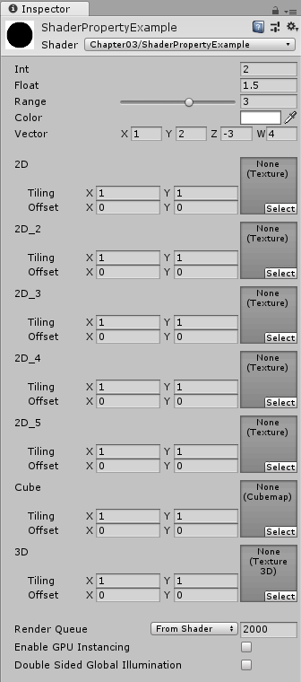
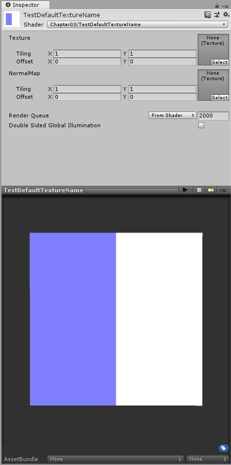
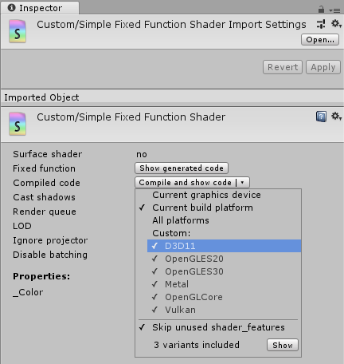

# 第3章 unity shader基础

当没有unity时，直接使用图像编程接口，将会需要类似下面的伪代码：

略

（我并不关心Unity之外的体系是如何处理Shader加载、运行的，应该聚焦于Unity Shader自身。）

## 3.1 unity shader 概述

### 3.1.1 一对好兄弟：材质与shader

在unity中，unity shader实例化后，成为材质。在材质上可以调整该unity shader定义的各种纹理、属性等参数。

### 3.1.2 unity中的材质

unity为材质提供了可视化的调节面板，使得开发者不再需要在代码中设置和改变渲染所需的各种参数。

### 3.1.3 unity中的shader

unity shader需要与材质结合使用。新建的材质，更改shader后，材质面板中就会显示该shader的各种属性，例如颜色、纹理、浮点数、滑动条、向量等。

## 3.2 unity shader的基础：shaderlab语言

unity shader是Unity提供的高层级的渲染抽象层。通过这种方式让开发者能更加轻松地控制渲染。



左图为没有使用unity shader的情况。开发者需要和很多文件和设置打交道。右图为在unity shader的帮助下，开发者只需要使用shaderlab来编写unity shader即可完成所有的工作。

在unity中，所有的unity shader都是使用shaderlab来编写的。shaderlab是unity提供的一种说明性语言。它使用了一些嵌套在花括号内部的语法来描述一个unity shader文件的结构。这些结构包含了许多渲染所需要的数据。从设计上来说，shaderlab类似于cgfx和direct3d effects语言。它们都定义了要显示一个材质所需的所有东西，而不仅仅是着色器代码。

一个unity shader的基础结构如下所示：

```shaderlab
    Shader "ShaderName" {
        Properties {
            //属性定义
        }
        SubShader {
            //显卡A使用的子着色器
        }
        SubShader {
            //显卡B使用的子着色器
        }
        Fallback "VertexLit"
    }
```

unity会在背后根据使用的平台把这些结构编译成真正的代码和shader文件，而开发者只需要和unity shader打交道即可。

## 3.3 Unity shader的结构

### 3.3.1 shader的名字

shader的名字可以含有斜杠，用以分类。

```shaderlab
    Shader "Custom/MyShader" {

    }
```

### 3.3.2 Properties属性定义

Properties语法如下：

```shaderlab
    Properties {
        propertyName ("displayName", PropertyType) = DefaultValue
    }
```

- propertyName通常以下划线开头，用于在shader代码中访问。
- displayName是用于在材质面板上显示的名称。
- 属性有类型。
- 属性可以设定默认值。

表3.1 Properties语句支持的属性类型

属性类型 | 默认值语法 | 例子
:- | :- | :- |
Int | number | _Int("Int", Int) = 2
Float | number | _Float("Float", Float) = 1.5
Range | number | _Range("Range", Range(0.0, 5.0)) = 3.0
Color | (r, g, b, a) | _Color("Color", Color) = (1.0, 1.0, 1.0, 1.0)
Vector | (x, y, z, w) | _Vector("Vector", Vector) = (1.0, 2.0, -3.0, 4.0)
2D | "默认纹理名称" {} | _2D("2D", 2D) = "" {}
2D | "默认纹理名称" {} | _2D("2D", 2D) = "white" {}
2D | "默认纹理名称" {} | _2D("2D", 2D) = "black" {}
2D | "默认纹理名称" {} | _2D("2D", 2D) = "gray" {}
2D | "默认纹理名称" {} | _2D("2D", 2D) = "bump" {}
Cube | "默认纹理名称" {} | _Cube("Cube", Cube) = "white" {}
3D | "默认纹理名称" {} | _3D("3D", 3D) = "black" {}

下面的代码给出了一个展示所有属性类型的例子：

```shaderlab
Shader "Chapter03/ShaderPropertyExample" {
    Properties {
        //数值以及滑动条
        _Int("Int", Int) = 2
        _Float("Float", Float) = 1.5
        _Range("Range", Range(0.0, 5.0)) = 3.0
        //颜色和向量
        _Color("Color", Color) = (1.0, 1.0, 1.0, 1.0)
        _Vector("Vector", Vector) = (1.0, 2.0, -3.0, 4.0)
        //纹理
        _2D("2D", 2D) = "" {}
        _2D_2("2D_2", 2D) = "white" {}
        _2D_3("2D_3", 2D) = "black" {}
        _2D_4("2D_4", 2D) = "gray" {}
        _2D_5("2D_5", 2D) = "bump" {}
        _Cube("Cube", Cube) = "white" {}
        _3D("3D", 3D) = "black" {}
    }

    Fallback "Diffuse"
}
```

下图给出了上述代码在材面板中显示的结果。



图3.8 不同属性类型在材质面板中显示的结果。

看起来纹理类型的默认纹理名称并不能在材质面板中体现。在运行时才体现。

测试代码如下：

```shaderlab
//这段代码修改自Unlit模板。
Shader "Chapter03/TestDefaultTextureName"
{
    Properties
    {
        _MainTex ("Texture", 2D) = "white" {}
        _NormalTex ("NormalMap", 2D) = "bump" {}
    }
    SubShader
    {
        Tags { "RenderType"="Opaque" }
        LOD 100

        Pass
        {
            CGPROGRAM
            #pragma vertex vert
            #pragma fragment frag
            // make fog work
            #pragma multi_compile_fog

            #include "UnityCG.cginc"

            struct appdata
            {
                float4 vertex : POSITION;
                float2 uv : TEXCOORD0;
            };

            struct v2f
            {
                float2 uv : TEXCOORD0;
                UNITY_FOG_COORDS(1)
                float4 vertex : SV_POSITION;
            };

            sampler2D _MainTex;
            float4 _MainTex_ST;

            sampler2D _NormalTex;
            float4 _NormalTex_ST;

            v2f vert (appdata v)
            {
                v2f o;
                o.vertex = UnityObjectToClipPos(v.vertex);
                o.uv = TRANSFORM_TEX(v.uv, _MainTex);
                UNITY_TRANSFER_FOG(o,o.vertex);
                return o;
            }

            fixed4 frag (v2f i) : SV_Target
            {
                // sample the texture
                fixed4 col = fixed4(1, 1, 1, 1);
                if (i.uv.x > 0.5)
                {
                    col = tex2D(_MainTex, i.uv);
                }
                else
                {
                    col = tex2D(_NormalTex, i.uv);
                }
                // apply fog
                UNITY_APPLY_FOG(i.fogCoord, col);
                return col;
            }
            ENDCG
        }
    }
}
```

其材质面板的预览效果如下：



可以看出来，默认的bump纹理对法线方向没有扰动。参见 [为什么法线贴图偏蓝色？](https://blog.csdn.net/taoqilin/article/details/49976927) 中对法线贴图的解释。

Unity允许我们重载默认的材质编辑面板，以提供更多自定义的数据类型。参见官方手册 [Custom Shader GUI](https://docs.unity3d.com/Manual/SL-CustomShaderGUI.html) 这篇文章。

为了在shader中可以访问到这些属性，需要在CG代码片中定义和这些属性类型相匹配的变量。即使不在Properties块中声明这些属性，也可以直接在CG代码片中定义变量。此时可以通过脚本向shader传递这些属性值。

Properties块的作用仅仅是为了让这些属性可以出现在材质面板中。

### 3.3.3 SubShader

每个unity shader文件包含至少一个SubShader块（SubShader的数量 $\ge$ 1）。当unity需要加载这个shader时，它会扫描所有的SubShader，然后选择第一个能够在目标平台上运行的SubShader。如果都不支持的话，它就会使用Fallback指定的shader。

不同的显卡具有不同的能力。一些旧的显卡仅能支持一定数目的操作指令，而一些更高级的显卡可以支持更多的指令。我们就可以使用SubShader功能，在旧的显卡上使用计算复杂度较低的着色器，而在高级的显卡上使用计算复杂度较高的着色器，以便提供更出色的画面。

SubShader的定义通常如下：

```shaderlab
SubShader {
    //Tags
    Tags { "TagName" = "Value" ...}
    
    //RenderSetup
    Cull Back
    ZTest Less
    ZWrite On
    Blend SrcFactor DstFactor

    Pass {

    }
    //其他Pass
}
```

SubShader定义了一系列Pass以及可选的状态和标签设置。每个Pass定义了一次完整的渲染流程。如果Pass数量过多，会造成渲染性能下降。
状态与标签也可以在Pass内部声明。
在SubShader级别声明的状态，将会应用到其内部的所有Pass。

#### 3.3.3.1 状态设置（RenderSetup）

表3.2 常见的渲染状态设置指令

状态名称 | 设置指令 | 作用
:- | :- | :-
Cull | Cull Off \| Back \| Front | 剔除模式：关闭、剔除背面、剔除正面
ZTest | ZTest Less \| Greater \| LEqual \| GEqual \| Equal \| NotEqual \| Always | 深度测试时使用的函数
ZWrite | ZWrite On \| Off | 开启、关闭深度写入
Blend | Blend SrcFactor DstFactor | 开启并且设置混合模式

在Pass内部可以声明自己的渲染状态设置，以覆盖SubShader声明的渲染状态设置。

#### 3.3.3.2 SubShader的Tags

SubShader的标签是一个键值对，两者都是字符串类型。

表3.3 SubShader的标签类型

标签类型 | 说明 | 例子 | 不指定该标签时的默认值
:- | :- | :- | :-
Queue | 控制渲染顺序，指定该物体属于哪一个渲染队列，通过这种方式可以保证所有的透明物体可以在所有不透明物体后面被渲染。也可以自定义渲染队列来控制物体的渲染顺序。 | Tags { "Queue" = "Transparent" } | /
RenderType | 对着色器进行分类。这可以被用于着色器替换功能（Shader Replacement）。 | Tags { "RenderType" = "Opaque" } | /
DisableBatching | 是否禁用批处理。某些SubShader在使用批处理功能时会出现问题，这时可以通过该标签禁用批处理。 | Tags { "DisableBatching" = "True" } | False
ForceNoShadowCasting | 是否禁用阴影投射 | Tags { "ForceNoShadowCasting" = "True" } | False
IgnoreProjector | 是否忽略Projector的影响。通常用于半透明物体 | Tags { "IgnoreProjector" = "True" } | False
CanUseSpriteAtlas | 是否支持精灵图集。如果某个图片精灵被设置为打包进图集中，那么当此精灵所指定Shader中此标签设置为False时将会无法正常工作，Unity将会给出警告 | Tags { "CanUseSpriteAtlas" = "False" } | True
PreviewType | 预览类型。指示材质面板将如何预览该材质。 | Tags { "PreviewType" = "Plane" } | Sphere（球体）

更多详细解释，参见 [零基础入门Unity Shader（九）- SubShader Tags](https://zhuanlan.zhihu.com/p/51080323)

以上表格里提到的标签仅限于在SubShader下使用。不能在Pass中声明。

#### 3.3.3.3 Pass

```shaderlab
Pass {
    [Name]
    [Tags]
    [RenderSetup]
    //其他代码
}
```

通过给Pass定义名称，可以使用UsePass指令来被其他shader使用。由于unity内部会把pass名称转换成大写形式，所以在使用UsePass指令时需要使用大写形式的名字。

```shaderlab
//如果定义了Pass的名字
Pass {
    Name "MyPassName"
    //...
}

//那么可以在另一个shader中引用上面定义Pass
Pass {
    UsePass "ShaderName/MYPASSNAME"
}
```

（疑问：上面的UsePass指令有可能遇到含有斜线分割符的Shader名称，可能造成Shader名称与Pass名称冲突的情况。）

Pass除了支持SubShader的状态设置，还支持固定管线的着色器命令。

Pass可以设置标签。这些标签不同于SubShader的标签，它们用于指导渲染引擎如何渲染物体。

表3.4 Pass的标签类型

标签类型 | 说明 | 例子 | 不指定该标签时的默认值
:- | :- | :- | :-
LightMode | 定义该Pass在渲染流水线中的角色 | Tags { "LightMode" = "ForwardBase" } | /
RequireOptions | 满足指定义的条件时才渲染该Pass，它的值是一个由空格分隔的字符串。 | Tags { "RequireOptions" = "SoftVegetation" } | /

unity还支持一些特殊的Pass。

- UsePass，用于复用其他shader里的命名Pass；
- GrabPass，该Pass抓取屏幕并将结果存储在一张纹理中，用于后续Pass处理。

### 3.3.4 Fallback

紧跟在所有的SubShader之后的可以是一个Fallback指令。如果上面所有的SubShader在这块显卡上都不能运行，那么就使用这个回退的shader。

```shaderlab
Fallback "FallbackShaderName"
//或关闭Fallback
Fallback Off
```

Fallback会影响阴影的投射。在渲染阴影纹理时，Unity会在每个unity shader中寻找一个阴影投射的Pass。通常情况下，我们不需要自己专门实现一个Pass，这是因为Fallback使用的内置shader中包含了这样一个通用的Pass。因此，为每个unity shader正确设置Fallback是非常重要的。

## 3.4 Unity Shader 的形式

在Unity中，可以使用3种形式来编写unity shader——表面着色器、顶点片元着色器、固定函数着色器。

### 3.4.1 表面着色器（Surface Shader）

当给unity提供一个表面着色器时，它在背后仍然是转换成对应的顶点片元着色器。表面着色器是unity对顶点片元着色器更高一层的抽象。其优点是unity代为处理了很多光照细节，使得我们不需要再操心。

一个非常简单的表面着色器示例代码如下所示：

```shaderlab
Shader "Custom/Simple Surface Shader" {
    SubShader {
        Tags { "RenderType" = "Opaque" }
        CGPROGRAM
        #pragma surface surf Lambert
        struct Input {
            float4 color: COLOR;
        };
        void surf(Input IN, inout SurfaceOutput o) {
            o.Albedo = 1;
        }
        ENDCG
    }
    Fallback "Diffuse"
}
```

表面着色器被定义在SubShader块，而非Pass块中。原因是，表面着色器不需要关心使用多少个Pass、每个Pass如何渲染等问题，unity会在背后做好这些事情。

### 3.4.2 顶点片元着色器

顶点片元着色器更加复杂，但灵活性更高。

一个非常简单的顶点片元着色器示例如下所示：

```shaderlab
Shader "Custom/Simple Vertex Fragment Shader" {
    SubShader {
        Pass {
            CGPROGRAM
            
            #pragma vertex vert
            #pragma fragment frag

            float4 vert(float4 v: POSITION): SV_POSITION {
                return mul(UNITY_MATRIX_MVP, v);
            }

            fixed4 frag(): SV_Target {
                return fixed4(1, 0, 0, 1)
            }

            ENDCG
        }
    }
}
```

### 3.4.3 固定函数着色器

一个非常简单的固定函数着色器示例如下：

```shaderlab
Shader "Custom/Simple Fixed Function Shader" {
    Properties {
        _Color("Main Color", Color) = (1, 0.5, 0.5, 1)
    }
    SubShader {
        Pass {
            Material {
                Diffuse [_Color]
            }
            Lighting On
        }
    }
}
```

在Unity 5.2中，所有固定函数着色器都会在背后被Unity编译成对应的顶点、片元着色器，因此真正意义上的固定函数着色器已经不存在了。

### 3.4.4 选择哪种unity shader形式

- 如果需要在仅支持固定函数着色器的旧设备上支行，那么才使用固定函数着色器。（疑问：如上面所说，在Unity 5.2中，固定函数着色器都会被编译为顶点、片元着色器，那么是否只能使用比Unity 5.2更旧的版本才能在这种旧设备上运行？）
- 与各种光源打交道时，使用表面着色器。
- 如果使用的光源数目非常少时，例如只有一个平行光，那么使用顶点、片元着色器。
- 如果有自定义渲染效果的需求，那么选择顶点片元着色器。

## 3.6 查看Unity Shader编译后的代码

Unity支持在导入设置面板上查看unity shader编译到目标平台后的代码，可用于Debug或优化。如图3.9所示。



当发布游戏时，数据文件中只包含目标平台所需要的编译代码，不需要的代码部分就会被移除。
