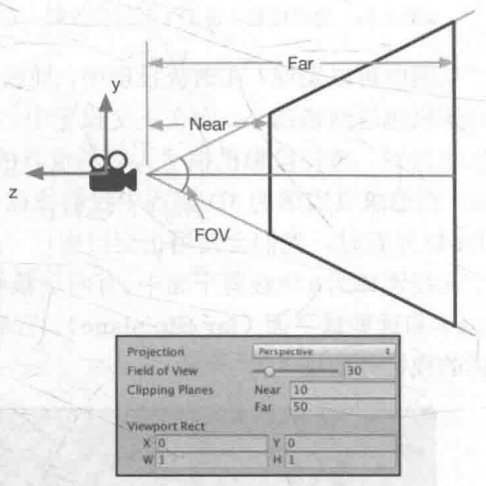
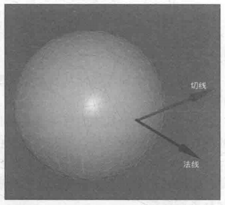

# 第4章 数学基础

计算机图形学是建立在虚拟世界上的数学模型。经常需要使用到矢量与矩阵（线性代数）。

## 笛卡尔坐标系

Cartesian coordinate system.

### 4.2.1 二维笛卡尔坐标系

图4.3 显示了一个二维笛卡尔坐标系。


一个二维笛卡尔坐标系包含了两部分信息：

- 一个特殊的位置——原点，它是整个坐标系的中心。
- 两条过原点并且互相垂直的矢量，即x轴和y轴。这些坐标轴也被称为该坐标系的基矢量。

### 4.2.2 三维直角坐标系


3个坐标轴之间互相垂直，且长度为1.

根据坐标轴方向，可以划分出两种坐标系：左手坐标系和右手坐标系。

### 4.2.3 左手坐标系与右手坐标系

如果两个坐标系具有相同的旋向性（handedness），那么我们就可以通过旋转的方法来让它们的坐标轴指向重合。但是，如果它们具有不同的旋向性，那么就无法达到重合的目的。


左手坐标系


右手坐标系

除了坐标轴朝向不同，两坐标系对于正向旋转的定义也不同。分别对应左手法则和右手法则。

### 4.2.4 Unity使用的坐标系

对于模型空间和世界空间，Unity使了左手坐标系。这意味着，在模型空间中，一个物体的右侧、上侧、前向分别对应了x轴、y轴、z轴的正方向。

对于观察空间来说，Unity使用的是右手坐标系。观察空间，一般是指以摄像机为原点的坐标系。

### 4.2.5 练习题

1. 在3DS max中，默认的坐标轴方向是：x轴正方向指向右方，y轴正方向指向前方，z轴正方向指向上方。问它是左手坐标系还是右手坐标系？（答：右手坐标系）
2. 在左手坐标系中，有一个点的坐标是(0, 0, 1)。如果把该点绕y轴旋转+90°，旋转后的坐标是多少？如果是在右手坐标系中，有一个点的坐标是（0, 0, 1)。如果把该点绕y轴旋转+90°，旋转后的坐标是多少？（答：在左手坐标系中，结果为(1, 0, 0)。在右手坐标系中，结果为(1, 0, 0)）
3. 在Unity中，新建的场景中主摄像机的位置位于世界空间中的(0, 1, -10)位置，保持Rotation为（0, 0, 0)，Scale为(1, 1, 1)。再在世界空间的(0, 1, 0)位置新建一个球体。问：在相机的观察空间下，球的坐标的z值是多少？在相机的模型空间下，球的坐标的z值是多少？（答：-10, 10）

## 4.3 点和矢量

点（point）是n维空间中的一个位置，它没有大小、宽度这类概念。在游戏中主要使用二维和三维空间。使用 $P=(x, y)$ 表示二维空间的点。使用 $P=(x, y, z)$ 表示三维空间中的点。

矢量（vector），也被称为向量，它的定义更复杂一些。矢量是指n维空间中一种包含了模（magnitude）和方向（direction）的有向线段。

矢量的模是指这个矢量的长度。矢量的模总是大于或等于0.

矢量的方向描述了这个矢量在空间中的指向。

使用 $\vec v = (x, y)$ 来表示二维矢量。

使用 $\vec v = (x, y, z)$ 来表示三维矢量。

使用 $\vec v = (x, y, z, w)$ 来表示四维矢量。

### 4.3.1 点和矢量的区别


图4.15 矢量以及它的头与尾


图4.16 点和矢量之间的关系

如果把矢量的尾固定在坐标系原点，那么这个矢量的表示就和点的表示重合了。如上图所示。

任何一个点都可以表示成一个从原点出发的矢量。

### 4.3.2 矢量运算

#### 4.3.2.1 矢量与标量的乘法、矢量与标量的除法

标量与矢量相乘，结果为该标量与该矢量的各个分量相乘：

$$
k \vec v = (kx, ky, kz)
$$


矢量被一个非零的标量除，结果为该矢量与该标量的倒数相乘：

$$
\frac{\vec v}{k} = \frac{1}{k}\vec v = (\frac{x}{k}, \frac{y}{k}, \frac{z}{k}), k \neq 0
$$

对于乘法来说，矢量与标量的位置可以互换。但是对于除法，只能是矢量被标量除。

从几何意义上看，把一个矢量$\vec v$和一个标量$k$相乘，意味着对矢量$\vec v$进行一个大小为$|k|$的缩放。当$k$小于0时，矢量的方向将会取反。


图4.17 矢量与标量的乘法与除法

#### 4.3.2.2 矢量与矢量的加减法

两个相同维度的矢量相加或相减，其结果是一个相同维度的新矢量，两个矢量对应分量的相加或相减。

$$
\vec a + \vec b = (a_x + b_x, a_y + b_y, a_z + b_z)
$$

$$
\vec a - \vec b = (a_x - b_x, a_y - b_y, a_z - b_z)
$$

从几何意义上看，矢量$\vec a + \vec b$等于把矢量$\vec a$的头连接到矢量$\vec b$的尾，然后画一条从$\vec a$的尾到$\vec b$的头的矢量。这被称为矢量加法的三角形定则。


图4.18 二维矢量的加法与减法

#### 4.3.2.3 矢量的模

$$
|\vec v| = \sqrt{x^2 + y^2 + z^2}
$$

#### 4.3.2.4 单位矢量

单位矢量（unit vector）是指模为1的矢量。也被称之为被归一化的矢量（normalized vector）。

对于任何给定的非零矢量，把它转换成单矢量的过程被称为归一化（normalization）。

通过在一个矢量的头上添加戴帽符号来表示单位矢量，例如 $\hat{\vec v}$.

$$
\hat{\vec v} = \frac{\vec v}{|\vec v|}, 其中 \vec v 是非零矢量
$$

#### 4.3.2.5 矢量的点积

$$
\vec a \cdot \vec b = (a_x, a_y, a_z) \cdot (b_x, b_y, b_z) = a_xb_x + a_yb_y + a_zb_z
$$

点积满足交换律，即 $\vec a \cdot \vec b = \vec b \cdot \vec a$

点积的一个几何意义就是投影（projection）。通俗的解释就是，有一个光源，它发出的光线垂直于 $\hat{\vec a}$ 方向，那么$\vec b$在$\hat{\vec a}$方向上的投影就是$\vec b$在$\hat{\vec a}$方向上的影子。如下图所示。


图4.22 矢量$\vec b$在单位矢量$\hat{\vec a}$方向上的投影

投影结果的正负号与两个向量的夹角有关。

- 当夹角大于90°时，结果小于0；
- 当夹角为90°时，结果为0；
- 当夹角小于90°时，结果大于0；

参见图4.23.


性质1：点积可结合标量乘法

$$
(k \vec a) \cdot \vec b = \vec a \cdot (k \vec b) = k(\vec a \cdot \vec b)
$$

性质2：点积与矢量的加法和减法结合

$$
\vec a \cdot (\vec b + \vec c) = \vec a \cdot \vec b + \vec a \cdot \vec c
$$

性质3：一个矢量和本身进行点积的结果，是该矢量的模的平方。

$$
\vec v \cdot \vec v = x^2 + y^2 + z^2 = |\vec v|^2
$$

$$
\vec a \cdot \vec b = |\vec a||\vec b|\cos \theta，\theta为两向量的夹角
$$

#### 4.2.3.6 矢量的叉积

矢量叉积的结果仍是一个矢量。

$$
\vec a \times \vec b = (a_yb_z - a_zb_y, a_zb_x - a_xb_z, a_xb_y - a_yb_x)
$$


辅助记忆表格，结果位于第三个分量。


辅助记忆三棱柱，某个面的计算结果对应于对面棱的分量。

叉积不满足交换律，即 $\vec a \times \vec b \neq \vec b \times \vec a$。
叉积满足反交换律，即 $\vec a \times \vec b = -(\vec b \times \vec a)$。
叉积不满足结合律，即 $(\vec a \times \vec b) \times \vec c \neq \vec a \times (\vec b \times \vec c)$。

对两个矢量进行叉积的结果会得到一个同时垂直于这两个矢量的新矢量。

$|\vec a \times \vec b| = |\vec a||\vec b|\sin \theta , 其中 \theta 为两向量的夹角。$


这个平行四边形的面积如下：

$$
A = |\vec b|h = |\vec b|(|vec a|\sin \theta) = |\vec a||\vec b|\sin \theta = |\vec a \times \vec b|
$$


### 4.3.3 练习题

1. 是非题
    1. 一个矢量的大小不重要，我们只需要在正确的位置把它画出来就可以了。（错误，大小很重要。另外矢量没有位置，可以随意把它放在空间的任何位置。）
    2. 点可以认为是位置矢量，这是通过把矢量的尾固定在原点得到的。（正确）
    3. 选择左手坐标系还是右手坐标系很重要，因为这会影响叉积的计算。（错误。无影响。在把数字转换成视学表现的时候，选择不同的坐标系可能会得到不同的结果。）
2. 计算题
    1. $|(2, 7, 3)|$ （结果=$\sqrt{2^2 + 7^2 + 3^2} = \sqrt{62}$）
    2. $2.5(5, 4, 10)$（结果=$(12.5, 10, 25)$）
    3. $\frac{(3,4)}{2}$（结果=$(1.5, 2)$）
    4. 对(5, 12)进行归一化。（$\frac{(5, 12)}{|(5, 12)|} = \frac{(5, 12)}{13}= (\frac{5}{13}, \frac{12}{13})$）
    5. 对(1,1,1)进行归一化。（$\frac{(1,1,1)}{|(1,1,1)|} = \frac{(1,1,1)}{\sqrt{3}} = (\frac{\sqrt 3}{3},\frac{\sqrt 3}{3},\frac{\sqrt 3}{3})$）
    6. (7,4)+(3,5)（结果=$(10,9)$）
    7. (9,4,13)-(15,3,11)（结果=$(-6,1,2)$）
3. 两点间距离问题。假设，场景中有一个光源，位置在（10, 13, 11)处，还有一个点(2,1,1)，那么光源距离该点的距离是多少？答：$d = |(10,13,11) - (2,1,1)| = |(8,12,10)| = \sqrt{8^2+12^2+10^2} = \sqrt{308} = 2 \sqrt{77}$
4. 计算题
    1. $(4,7)\cdot(3,9)$ （答：$4 \times 3 + 7 \times 9 = 12+63 = 75$）
    2. $(2,5,6)\cdot(3,1,2)-10$ （答：$2 \times 3 + 5 \times 1 + 6 \times 2 - 10 = 6+5+12-10 = 13$）
    3. $0.5(-3,4)\cdot(-2,5)$ （答：$(-\frac{3}{2},2)\cdot(-2,5) = -\frac{3}{2}\times(-2)+2\times 5 = 3+10 = 13$）
    4. $(3,-1,2)\times(-5,4,1)$ （答：$(-1 \times 1 - 2 \times 4, 2 \times (-5) - 3 \times 1, 3 \times 4 - (-1)\times(-5)) = (-1 - 8, -10 - 3, 12-5) = (-9,-13,7)$）
    5. $(-5,4,1)\times(3,-1,2)$ （答：根据反交换律，结果 = $-(3,-1,2)\times(-5,4,1) = (9,13,-7)$）
5. 已知矢量$\vec a$和矢量$\vec b$，$\vec a$的模为4，$\vec b$的模为6，它们之间的夹角为60°。计算：
    1. $\vec a \cdot \vec b$ （结果 = $|\vec a||\vec b|\cos60° = 4 \times 6 \times \frac{1}{2} = 12$）
    2. $|\vec a \times \vec b|$ （结果= $|\vec a||\vec b|\sin60° = 4 \times 6 \times \frac{\sqrt3}{2} = 12\sqrt3$）
6. 假设，场景中有一个NPC，它位于点p处，它的前方（forward)可以使用矢量$\vec v$来表示.
    1. 如果现在玩家运动到了点x处，那么如何判断玩家是在NPC的前方还是后方？请使用数学公式来描述你的答案。提示：使用点积。（计算 $(x - p) \cdot \vec v$ 的大小，如果点积的结果大于0说明玩家在NPC的前方，如果等于0，说明玩家在NPC的左侧或者右侧，如果小于0，则说明玩家在NPC的后方。）
    2. 使用你在1中提到的方法，代入 $p=(4,2), v=(-3,4), x=(10,6)$ 来验证你的答案。 （代入计算得-2，所以玩家位于NPC的后方。）
    3. 现在，游戏有了新的需求：NPC只能观察到有限的视角范围，这个视角的角度是$\phi$，也就是说NPC最多只能看到它前方左侧或者右侧$\frac{\phi}{2}$角度内的物体。那么我们如何通过点积来判断NPC是否能看到点x呢？（设$\theta$为$\vec v 与 \vec{PX}$向量的夹角，如果$\theta 小于 \frac{\phi}{2}$, 那么NPC就能看到点x。想要使$\theta 小于 \frac{\phi}{2}$，只要使$\cos\theta > \cos\frac{\phi}{2}$。而其中的$\cos\theta = \frac{\vec{PX}\cdot\vec v}{|\vec{PX}||\vec v|}$。也即$\frac{\vec{PX}\cdot\vec v}{|\vec{PX}||\vec v|} > \cos\frac{\phi}{2}$时，就能看到点x，否则看不到点x。）
    4. 在第3条的基础上，策划又有了新的需求：NPC的观察距离也有了限制，它只能看到固定距离内的对象，现在该如何判断呢？（设NPC的最大观察距离为d，则能看到点x的条件之一为$|\vec{PX}| \le d$，结合第3条的结果，两个条件都满足才能看到，即$|\vec{PX}| \le d 且 \frac{\vec{PX}\cdot\vec v}{|\vec{PX}||\vec v|} > \cos\frac{\phi}{2}$时才能看到点x。）
7. 在渲染中我们常常会需要判断一个三角面片是正面还背面，这可以通过判断三角形的3个顶点在当前空间中是顺时针还是逆时针排列来得到。给定三角形的3个顶点$p_1,p_2,p_3$，如何利用叉积来判断这3个顶点的顺序是顺时针还是逆时针？假设我们使用的是左手坐标系，且$p_1,p_2,p_3$都位于xy平面，人眼位于z轴的负方向上，向z轴正方向观察，如图4.29所示。


答：取向量 $\vec a = (\vec p_2 - \vec p_1), \vec b = (\vec p_3 - \vec p_1)$，求$\vec a \times \vec b$的结果。如果叉积结果向量的z分量大于0，说明是顺时针。如果小于0，说明是逆时针。如果为0，说明这三个点共线，无法构成三角形。

## 4.4 矩阵

一个$3 \times 3$的矩阵，可以写成如下形式：

$$
\boldsymbol{M} =
\left[
\begin{matrix}
   m_{11} & m_{12} & m_{13} \\
   m_{21} & m_{22} & m_{23} \\
   m_{31} & m_{32} & m_{33}
\end{matrix}
\right]
$$

$m_{ij}$表明了这个元素在矩阵$\boldsymbol{M}$的第$i$行、第$j$列。
矩阵有行矩阵和列矩阵。

### 4.4.2 矩阵与矢量的关系

矢量可以看成是$n \times 1$的列矩阵（column matrix），或者是 $1 \times n$的行矩阵（row matrix），其中n对应了矢量的维度。例如$\vec v = (x,y,z)$可以写成行矩阵$\left[ \begin{matrix} x & y & z \end{matrix} \right]$，或列矩阵$\left[ \begin{matrix} x \\ y \\ z \end{matrix} \right]$。

通过将矢量表达成矩阵，可以让矢量像一个矩阵一样一起参与距阵运算。

### 4.4.3 矩阵运算

#### 4.4.3.1 矩阵与标量的乘法

矩阵与标量相乘，它的结果仍然是一个相同维度的矩阵，原矩阵的每个元素分别与该标量相乘。

$$
k\boldsymbol{M} = \boldsymbol{M}k = k
\left[
\begin{matrix}
   m_{11} & m_{12} & m_{13} \\
   m_{21} & m_{22} & m_{23} \\
   m_{31} & m_{32} & m_{33}
\end{matrix}
\right] =
\left[
\begin{matrix}
   km_{11} & km_{12} & km_{13} \\
   km_{21} & km_{22} & km_{23} \\
   km_{31} & km_{32} & km_{33}
\end{matrix}
\right]
$$

#### 4.4.3.2 矩阵与矩阵相乘

设有$r \times n$的矩阵$\boldsymbol{A}$和一个$n \times c$的矩阵$\boldsymbol{B}$，它们相乘会得到一个$r \times c$的矩阵$\boldsymbol{C} = \boldsymbol{AB}$。那么$\boldsymbol{C}$中的每一个元素$c_{ij}$等于$\boldsymbol{A}$的第$i$行所对应的矢量和$\boldsymbol{B}$的第$j$列所对应的矢量进行矢量点乘的结果，即

$$
c_{ij} = a_{i1}b_{1j} + a_{i2}b_{2j} + \cdots + a_{in}b_{nj} = \sum\limits_{k=1}^{n}{a_{ik}b_{kj}}
$$

矩阵乘法满足一些性质。

##### 4.4.3.2.1 矩阵乘法不满足交换律

通常情况下，$\boldsymbol{AB}\neq\boldsymbol{BA}$

##### 4.4.3.2.2 矩阵乘法满足结合律

$(\boldsymbol{AB})\boldsymbol{C} = \boldsymbol{A}(\boldsymbol{BC})$

### 4.4.4 特殊的矩阵

#### 4.4.4.1 方块矩阵

方块矩阵（square matrix），简称方阵，是指那些行和列数目相等的矩阵。

方阵的对角元素是指行号和列号相等的元素，例如$m_{11}, m_{22}, m_{33}$等。

如果一个矩阵除了对角元素外的所有元素都为0，那么这个矩阵就叫做对角矩阵（diagonal matrix）。

#### 4.4.4.2 单位矩阵

一个特殊的对角矩阵是单位矩阵（identity matrix），用$\boldsymbol{I}_n$来表示。一个$3 \times 3$的单位矩阵如下：

$$
\boldsymbol{I}_3 =
\left[
\begin{matrix}
   1 & 0 & 0 \\
   0 & 1 & 0 \\
   0 & 0 & 1
\end{matrix}
\right]
$$

任何矩阵与单位矩阵相乘的结果为原来的矩阵，即：

$\boldsymbol{MI} = \boldsymbol{IM} = \boldsymbol{M}$

#### 4.4.4.3 转置矩阵

转置矩阵（transposed matrix）实际是对原矩阵的一种运算，即转置运算。给定一个$r \times c$的矩阵$\boldsymbol{M}$，它的转置表示成$\boldsymbol{M}^T$，这是一个$c \times r$的矩阵。原矩阵的第$i$行变成第$i$列，而第$j$列变成第$j$行。

$\boldsymbol{M}_{ij}^T = \boldsymbol{M}_{ji}$


可以使用转置操作来转换行列矩阵：

$$
\left[
\begin{matrix}
   x & y & z
\end{matrix}
\right]^T = 
\left[
\begin{matrix}
   x \\
   y \\
   z
\end{matrix}
\right]
$$

$$
\left[
\begin{matrix}
   x \\
   y \\
   z
\end{matrix}
\right]^T = 
\left[
\begin{matrix}
   x & y & z
\end{matrix}
\right]
$$

##### 4.4.4.3.1 矩阵的转置的转置等于原矩阵

$(\boldsymbol{M}^T)^T = \boldsymbol{M}$

##### 4.4.4.3.2 矩阵串接的转置，等于反向串接各个矩阵的转置

$(\boldsymbol{AB})^T = \boldsymbol{B}^T\boldsymbol{A}^T$

#### 4.4.4.4 逆矩阵

只有方阵才有逆矩阵。

给定一个方阵$\boldsymbol{M}$，它的逆矩阵用$\boldsymbol{M}^{-1}$来表示。逆矩阵与原矩阵相乘的结果为单位矩阵。即：

$\boldsymbol{MM}^{-1} = \boldsymbol{M}^{-1}\boldsymbol{M} = \boldsymbol{I}$

并非所有的方阵都有对应的逆矩阵。如果一个矩阵有对应的逆矩阵，我们就说这个矩阵是可逆的（invertible）或者说是非奇异的（nonsingular）；相反的，如果一个矩阵没有对应的逆矩阵，我们就说它是不可逆的（noninvertible）或者说是奇异的（singular）。

##### 4.4.4.4.1 逆矩阵的逆矩阵是原矩阵本身

假设矩阵$\boldsymbol{M}$是可逆的，那么
$$
(\boldsymbol{M}^{-1})^{-1} = \boldsymbol{M}
$$

##### 4.4.4.4.2 单位矩阵的逆矩阵是它本身

$$
\boldsymbol{I}^{-1} = \boldsymbol{I}
$$

##### 4.4.4.4.3 转置矩阵的逆矩阵是逆矩阵的转置

$$
(\boldsymbol{M}^T)^{-1} = (\boldsymbol{M}^{-1})^T
$$

##### 4.4.4.4.4 矩阵串接相乘后的逆矩阵等于反向串接各个矩阵的逆矩阵

$$
(\boldsymbol{AB})^{-1} = \boldsymbol{B}^{-1}\boldsymbol{A}^{-1}
$$

#### 4.4.4.5 正交矩阵

如果一个矩阵$\boldsymbol{M}$和它的转置矩阵的乘积是单位矩阵的话，则称这个矩阵是正交的（orthogonal）。

$$
矩阵\boldsymbol{M}是正交的 \leftrightarrow \boldsymbol{MM}^T = \boldsymbol{M}^T\boldsymbol{M} = \boldsymbol{I} \leftrightarrow \boldsymbol{M}^T = \boldsymbol{M}^{-1}
$$

### 4.4.5 行矩阵还是列矩阵

这里的行矩阵还是列矩阵指的是矢量转换成的矩阵。即$\vec v = (x,y,z)$既可以转换成行矩阵$\left[\begin{matrix} x & y & z \end{matrix}\right]$，也可以转换成列矩阵$\left[\begin{matrix} x \\ y \\ z \end{matrix}\right]$。

设矩阵$\boldsymbol{M}$为

$$
\boldsymbol{M} = 
\left[\begin{matrix}
   m_{11} & m_{12} & m_{13} \\
   m_{21} & m_{22} & m_{23} \\
   m_{31} & m_{32} & m_{33}
\end{matrix}\right]
$$

受矩阵乘法的行列数要求所限，行矩阵与$\boldsymbol{M}$相乘只能是$\vec v\boldsymbol{M}$，矢量在左侧，矩阵在右侧。

$$
\vec v\boldsymbol{M} = \left[\begin{matrix} xm_{11}+ym_{21}+zm_{31} & xm_{12}+ym_{22}+zm_{32} & xm_{13}+ym_{23}+zm_{33} \end{matrix}\right]
$$

而如果和列矩阵相乘，则要求矩阵在左侧，矢量在右侧，其结果为：

$$
\boldsymbol{M}\vec v = 
\left[\begin{matrix} xm_{11}+ym_{12}+zm_{13} \\ xm_{21}+ym_{22}+zm_{23} \\ xm_{31}+ym_{32}+zm_{33} \end{matrix}\right]
$$

上述两种结果，除了行列矩阵的区别外，里面的元素也不一样。这就意味着，在把矢量和矩阵相乘时选择行矩阵还是列矩阵来表示矢量是非常重要的，这决定了矩阵乘法的书写次序和结果值。

在unity中，常规做法是把矢量放在矩阵的右侧，即把矢量转换为列矩阵来进行运算。

$$\boldsymbol{CBA}\vec v = (\boldsymbol{C}(\boldsymbol{B}(\boldsymbol{A}\vec v)))$$

使用列向量的结果是，变换的顺序是从右到左，即先对$\vec v$使用$\boldsymbol{A}$进行变换，再使用$\boldsymbol{B}$进行变换，最后使用$\boldsymbol{C}$进行变换。

上面的计算等价于下面的行矩阵运算：

$$\vec v \boldsymbol{A}^T \boldsymbol{B}^T \boldsymbol{C}^T = (((\vec v \boldsymbol{A}^T)\boldsymbol{B}^T)\boldsymbol{C}^T)$$

根据4.4.4.3.2 矩阵串接的转置，等于反向串接各个矩阵的转置，变换可得。

### 4.4.6 练习题

1\. 判断下面矩阵的乘法是否存在。如果存在，计算它们的乘积。
(1) $\left[\begin{matrix} 1 & 3 \\ 2 & 4 \end{matrix}\right]\left[\begin{matrix} -1 & 5 \\ 0 & 2 \end{matrix}\right]$
答：第一个矩阵的列数等于第二个矩阵的行数，所以它们的乘法存在。其乘积为
$\left[\begin{matrix} -1 & 11 \\ -2 & 18 \end{matrix}\right]$

(2) $\left[\begin{matrix} 2 & 4 & 3 \\ 2 & 1 & 4 \end{matrix}\right]\left[\begin{matrix} -1 & 5 \\ 0 & 2 \\ 3 & 10 \end{matrix}\right]$
答：第一个矩阵的列数等于第二个矩阵的行数，所以它们的乘法存在，其乘积为
$\left[\begin{matrix} 7 & 48 \\ 10 & 52 \end{matrix}\right]$

(3) $\left[\begin{matrix} 1 & -2 & 3 \\ 5 & 1 & 4 \\ 6 & 0 & 3 \end{matrix}\right]\left[\begin{matrix} -5 \\ 4 \\ 8 \end{matrix}\right]$
答：第一个矩阵的列数等于第二个矩阵的行数，所以它们的乘法存在，其乘积为
$\left[\begin{matrix} 11 \\ 11 \\ -6 \end{matrix}\right]$

2\. 判断下面的矩阵是否是正交矩阵。
(1) $\left[\begin{matrix} 1 & 0 & 0 \\ 1 & 0 & 0 \\ 1 & 0 & 0 \end{matrix}\right]$
答：因为$\left[\begin{matrix} 1 & 0 & 0 \\ 1 & 0 & 0 \\ 1 & 0 & 0 \end{matrix}\right]\left[\begin{matrix} 1 & 0 & 0 \\ 1 & 0 & 0 \\ 1 & 0 & 0 \end{matrix}\right]^T = \left[\begin{matrix} 1 & 1 & 1 \\ 1 & 1 & 1 \\ 1 & 1 & 1 \end{matrix}\right] \neq \boldsymbol{I}_3$，所以它不是正交矩阵。

(2) $\left[\begin{matrix} 1 & 0 & 0 & 0 \\ 0 & 1 & 0 & 0 \\ 0 & 0 & 1 & 0 \\ 0 & 0 & 0 & 1 \end{matrix}\right]$
答：因为$\boldsymbol{I}_4\boldsymbol{I}_4^T = \boldsymbol{I}_4^T = \boldsymbol{I}_4$，所以它是正交矩阵。

(3) $\left[\begin{matrix} \cos\theta & -\sin\theta & 0 \\ \sin\theta & \cos\theta & 0 \\ 0 & 0 & 1 \end{matrix}\right]$
答：因为$\left[\begin{matrix} \cos\theta & -\sin\theta & 0 \\ \sin\theta & \cos\theta & 0 \\ 0 & 0 & 1 \end{matrix}\right]\left[\begin{matrix} \cos\theta & -\sin\theta & 0 \\ \sin\theta & \cos\theta & 0 \\ 0 & 0 & 1 \end{matrix}\right]^T = \left[\begin{matrix} \cos\theta & -\sin\theta & 0 \\ \sin\theta & \cos\theta & 0 \\ 0 & 0 & 1 \end{matrix}\right]\left[\begin{matrix} \cos\theta & \sin\theta & 0 \\ -\sin\theta & \cos\theta & 0 \\ 0 & 0 & 1 \end{matrix}\right] = \left[\begin{matrix} (\cos\theta)(\cos\theta) + (-\sin\theta)(-\sin\theta) + (0)(0) & (\cos\theta)(\sin\theta) + (-\sin\theta)(\cos\theta) + (0)(0) &  (\cos\theta)(0)+(-\sin\theta)(0)+(0)(1) \\ \sin\theta\cos\theta + \cos\theta(-\sin\theta)+(0)(0) & \sin\theta\sin\theta + \cos\theta\cos\theta + (0)(0) & (\sin\theta)(0)+(\cos\theta)(0)+(0)(1) \\ (0)\cos\theta+(0)(-\sin\theta)+(1)(0) & (0)\sin\theta+(0)\cos\theta+(1)(0) & (0)(0)+(0)(0)+(1)(1) \end{matrix}\right] = \left[\begin{matrix} \cos^2\theta+\sin^2\theta & 0 & 0 \\ 0 & \sin^2\theta+\cos^2\theta & 0 \\ 0 & 0 & 1 \end{matrix}\right] = \left[\begin{matrix} 1 & 0 & 0 \\ 0 & 1 & 0 \\ 0 & 0 & 1 \end{matrix}\right] = \boldsymbol{I}_3$，所以它是正交矩阵。

3\. 给定一个矢量(3,2,6)，分别把它当成行矩阵和列矩阵与下面的矩阵相乘。考虑两种情况下得到的矢量结果是否一样。如果不一样，考虑如何得到相同的结果。

(1) $\left[\begin{matrix} 1 & 0 & 0 \\ 0 & 1 & 0 \\ 0 & 0 & 1 \end{matrix}\right]$
答：因为是单位矩阵，所以给定的矢量与其相乘，将会得到本身，即$(3,2,6)$。

(2) $\left[\begin{matrix} 1 & 0 & 2 \\ 0 & 1 & -3 \\ 0 & 0 & 3 \end{matrix}\right]$
答：
矢量作为行矩阵时，计算结果如下：
$\left[\begin{matrix} 3 & 2 & 6 \end{matrix}\right]\left[\begin{matrix} 1 & 0 & 2 \\ 0 & 1 & -3 \\ 0 & 0 & 3 \end{matrix}\right] = \left[\begin{matrix} 3 & 2 & 18 \end{matrix}\right]$
矢量作为列矩阵时，计算结果如下：
$\left[\begin{matrix} 1 & 0 & 2 \\ 0 & 1 & -3 \\ 0 & 0 & 3 \end{matrix}\right]\left[\begin{matrix} 3 \\ 2 \\ 6 \end{matrix}\right] = \left[\begin{matrix} 15 \\ -16 \\ 18 \end{matrix}\right]$
将其中的$3\times 3$矩阵做一个转置，即可得到相同的结果。

(3) $\left[\begin{matrix} 2 & -1 & 3 \\ -1 & 5 & -3 \\ 3 & -3 & 4 \end{matrix}\right]$

答：记给定的矢量为$\boldsymbol{V} = \left[\begin{matrix} 3 & 2 & 6 \end{matrix}\right]$，记给定的矩阵为$\boldsymbol{M}$，那么有
$(\boldsymbol{VM})^T = \boldsymbol{M}^T\boldsymbol{V}^T$
其中的$\boldsymbol{V}^T$即为列矩阵。

观察得$\boldsymbol{M}^T = \boldsymbol{M}$，则有$(\boldsymbol{VM})^T = \boldsymbol{MV}^T$，所以把给定的矢量当成行矩阵和列矩阵与给定的矩阵相乘，得到的结果矢量相等。

## 4.5 矩阵的几何意义：变换

在三维渲染中矩阵可视化的结果就是变换。

### 4.5.1 什么是变换

变换（transform）指的是我们把一些数据，如点、方向矢量甚至是颜色等，通过某种方式进行转换的过程。

线性变换（linear transform）指的是那些可以保留矢量加和标量乘的变换。用数学公式表达即：

$$
f(x) + f(y) = f(x + y)
$$
$$
kf(x) = f(kx)
$$

线性变换包括：缩放（scale）、旋转（rotation）、错切（shear）、镜像（mirroring或reflection）、正交投影（orthographic projection）等。

仅有线性变换是不够的。考虑平移变换，例如$f(x) = x + (1,2,3)$。这个变换就不是一个线性变换，它满足标量乘法，但不满足矢量加法。令$x=(1,1,1)$，那么：
$f(x)+f(x) = (4,6,8)$
$f(x+x) = (3,4,5)$
可以看到两个运算的结果不一样。

仿射变换（affine transform）是合并线性变换和平移变换的变换类型。仿射变换可以使用一个$4 \times 4$的矩阵来表示。为此，需要把矢量扩展到四维空间下，这就是齐次坐标空间（homogeneous space）。

表4.1 常见的变换种类和它们的特性

变换名称 | 是线性变换吗 | 是仿射变换吗 | 是可逆矩阵吗 | 是正交矩阵吗
:-----: | :---------: | :---------: | :---------: | :----------:
平移    | 否           | 是          | 是          | 否
绕坐标轴旋转 | 是 | 是 | 是 | 是
绕任意轴旋转 | 是 | 是 | 是 | 是
按坐标轴缩放 | 是 | 是 | 是 | 否
错切 | 是 | 是 | 是 | 否
镜像 | 是 | 是 | 是 | 是
正交投影 | 是 | 是 | 否 | 否
透视投影 | 否 | 否 | 否 | 否

### 4.5.2 齐次坐标

由于$3 \times 3$矩阵不能表示平移操作，我们就把它扩展到了$4 \times 4$的矩阵。为此，还需要把原来的三维矢量转换成四维矢量，也就是所说的齐次坐标（homogeneous coordinate）。

对于一个点，从三维坐标转换成齐次坐标是把其$w$分量设为1，而对于方向矢量，需要把其$w$分量设为0。这样的设置会导致，用一个$4 \times 4$矩阵对一个点进行变换时，平移、旋转、缩放都会施加于该点。但是如果是用于变换一个方向矢量，平移的效果就会被忽略。

### 4.5.3 分解基础变换矩阵

把表示纯平移、纯旋转和纯缩放的变换矩阵叫做基础变换矩阵。这些矩阵具有一些共同点，可以把一个基础变换矩阵分解成4个组成部分：
$$
\left[\begin{matrix}
\boldsymbol{M}_{3 \times 3} & \boldsymbol{t}_{3 \times 1} \\
0_{1 \times 3} & 1
\end{matrix}\right]
$$
其中左上角的矩阵$\boldsymbol{M}_{3 \times 3}$用于表示旋转和缩放，$\boldsymbol{t}_{3 \times 1}$用于表示平移，$0_{1 \times 3}$是零矩阵，右下角的元素就是标量1。

### 4.5.4 平移矩阵

使用平移矩阵对一个点进行变换：

$$
\left[\begin{matrix}
1 & 0 & 0 & t_x \\
0 & 1 & 0 & t_y \\
0 & 0 & 1 & t_z \\
0 & 0 & 0 & 1
\end{matrix}\right]\left[\begin{matrix}
x \\
y \\
z \\
1
\end{matrix}\right] = \left[\begin{matrix}
x + t_x \\
y + t_y \\
z + t_z \\
1
\end{matrix}\right]
$$

如果对一个方向矢量进行平移变换，结果如下：

$$
\left[\begin{matrix}
1 & 0 & 0 & t_x \\
0 & 1 & 0 & t_y \\
0 & 0 & 1 & t_z \\
0 & 0 & 0 & 1
\end{matrix}\right]\left[\begin{matrix}
x \\
y \\
z \\
0
\end{matrix}\right] = \left[\begin{matrix}
x \\
y \\
z \\
0
\end{matrix}\right]
$$

平移矩阵的逆矩阵就是反向平移得到的矩阵，即

$$
\left[\begin{matrix}
1 & 0 & 0 & -t_x \\
0 & 1 & 0 & -t_y \\
0 & 0 & 1 & -t_z \\
0 & 0 & 0 & 1
\end{matrix}\right]
$$

### 4.5.5 缩放矩阵

对一个点沿着x轴、y轴、z轴进行缩放：

$$
\left[\begin{matrix}
k_x & 0 & 0 & 0 \\
0 & k_y & 0 & 0 \\
0 & 0 & k_z & 0 \\
0 & 0 & 0 & 1
\end{matrix}\right]\left[\begin{matrix}
x \\
y \\
z \\
1
\end{matrix}\right] = \left[\begin{matrix}
k_xx \\
k_yy \\
k_zz \\
1
\end{matrix}\right]
$$

对一个方向矢量沿着x轴、y轴、z轴进行缩放：

$$
\left[\begin{matrix}
k_x & 0 & 0 & 0 \\
0 & k_y & 0 & 0 \\
0 & 0 & k_z & 0 \\
0 & 0 & 0 & 1
\end{matrix}\right]\left[\begin{matrix}
x \\
y \\
z \\
0
\end{matrix}\right] = \left[\begin{matrix}
k_xx \\
k_yy \\
k_zz \\
0
\end{matrix}\right]
$$

如果缩放系数$k_x = k_y = k_z$，那么这样的缩放被称之为统一缩放（uniform scale），否则为非统一缩放（nonuniform scale）。统一缩放不会改变角度和比例信息，而非统一缩放会改变与模型相关的角度和比例。

缩放矩阵的逆矩阵就是使用原缩放系数的倒数来对点或方向矢量进行缩放，即：

$$
\left[\begin{matrix}
\frac{1}{k_x} & 0 & 0 & 0 \\
0 & \frac{1}{k_y} & 0 & 0 \\
0 & 0 & \frac{1}{k_z} & 0 \\
0 & 0 & 0 & 1
\end{matrix}\right]
$$

### 4.5.6 旋转矩阵

把点绕x轴旋转$\theta$度的变换如下：

$$
R_x(\theta) = 
\left[\begin{matrix}
1 & 0 & 0 & 0 \\
0 & \cos\theta & -\sin\theta & 0 \\
0 & \sin\theta & \cos\theta & 0 \\
0 & 0 & 0 & 1
\end{matrix}\right]
$$

把点绕y轴旋转$\theta$度的变换如下：

$$
R_y(\theta) = 
\left[\begin{matrix}
\cos\theta & 0 & \sin\theta & 0 \\
0 & 1 & 0 & 0 \\
-\sin\theta & 0 & \cos\theta & 0 \\
0 & 0 & 0 & 1
\end{matrix}\right]
$$

把点绕z轴旋转$\theta$度的变换如下：

$$
R_z(\theta) = 
\left[\begin{matrix}
\cos\theta & -\sin\theta & 0 & 0 \\
\sin\theta & \cos\theta & 0 & 0 \\
0 & 0 & 1 & 0 \\
0 & 0 & 0 & 1
\end{matrix}\right]
$$

旋转矩阵的逆矩阵是旋转相反角度得到的变换矩阵。即：

$$
R(\theta)R(-\theta) = I_4
$$

### 4.5.7 复合变换

可以把平移、旋转和缩放组合起来，来形成一个复杂的变换过程。复合变换可以通过矩阵的串联来实现。

$$
\boldsymbol{p}_{new} = \boldsymbol{M}_{平移}\boldsymbol{M}_{旋转}\boldsymbol{M}_{缩放}\boldsymbol{p}_{old}
$$

因为使用的是列矩阵，因此是先进行缩放变换，再进行旋转变换，最后进行平移变换。

在大多数情况下，约定变换的顺序就是先缩放，再旋转，最后平移。

注：下面的旋转角讨论实在看不懂。可以先看一下[这篇blog对欧拉角的讨论](https://blog.csdn.net/csxiaoshui/article/details/65437633)。涉及旋转角的组合方式（6种Tait-Bryan角，6种Proper Euler角）、旋转角度的参考坐标系（固定坐标系（extrinsic rotations）、相对物体自身的坐标系（intrinsic rotations））。

注：还可以参考[这篇讨论欧拉角细节、旋转顺序、内旋外旋的文章](https://zhuanlan.zhihu.com/p/85108850)。

当我们直接给出$(\theta_x, \theta_y, \theta_z)$这样的旋转角时，需要定义一个旋转顺序。再Unity中，这个旋转顺序是zxy。这意味着，当给定$(\theta_x, \theta_y, \theta_z)$这样的旋转角时，得到的组合旋转变换矩阵是：

$$
R_y(\theta_y)R_x(\theta_x)R_z(\theta_z)
$$

注：参考[unity euler angle测试项目](https://github.com/hoxily/unity_euler_angle/)，帮助理解内旋和外旋，以及Unity3D文档里说的zxy顺序。

## 4.6 坐标空间

注：对于Unity的GameObject层级结构来说，每个Transform对应于一个坐标空间。而向量的变换其实从内向外逐渐变换到世界坐标系下的。坐标空间对应于合并后的矩阵。

### 4.6.1 为什么使用这么多不同的坐标空间

拿生活中的示例说明各种相对参考系的便利性和作用。

拿问路时的坐标系举例，说明以路人为原点的前后左右坐标系，相对地球的东南西北的便利性。

所有的坐标空间在理论上都是平等的，没有谁优谁劣之分，不会因为我们从一个坐标空间转换到另一个坐标空间计算就出错了。但是在特定情况下，一些坐标空间的确比另一些坐标空间更加吸引人。

### 4.6.2 坐标空间的变换

要想定义一个坐标空间，需要指明其原点位置和3个坐标轴的方向。而这些数值实际上是相对于另一个坐标空间的。所有的坐标空间都是相对的。坐标空间会形成一个层次结构——每个坐标空间都是另一个坐标空间的子空间，反过来说，每个空间都有一个父空间。对坐标空间的变换实际上就是在父空间和子空间之间对点和矢量进行变换。

注：1.坐标系变换那里是否需要完整记录？2.MVP变换看起来使用GAMES101课程的作业来辅助可能效果会更好，毕竟闫令琪的投影矩阵推导过程很容易看懂。3.书中的小牛鼻子坐标点变换到屏幕的代入计算，可以尝试使用Unity工程建立场景，用涂上颜色的小球来代表鼻子进行直接观察。同时还可以读取相关的矩阵，跟书中的矩阵数值就行比对，加以验证。4. 坐标空间的旋向性变换如何验证？书中推导父空间变换到子空间的过程中，为什么只说了平移，而没有提到旋转呢？

自问自答：4.推导过程中因为已经给出了三个坐标轴在父空间下的表达，所以直接代入即可，也就沿着三个坐标轴平移。

假设，现在有一个父坐标空间$P$以及一个子坐标空间$C$。我们知道在父坐标空间下，子坐标空间的原点位置以及3个单位坐标轴。我们一般会有两种需求：一种需求是把子坐标空间下表示的点或矢量$A_c$转换到父坐标空间下的表示$A_p$，另一个需求是反过来，即把父坐标空间下表示的点或矢量$B_p$转换到子坐标空间下的表示$B_c$。我们可以使用下面的公式来表示这两种需求：

$$
A_p = \boldsymbol{M}_{c \rightarrow p} A_c
$$
$$
B_c = \boldsymbol{M}_{p \rightarrow c} B_p
$$

$\boldsymbol{M}_{c \rightarrow p}$和$\boldsymbol{M}_{p \rightarrow c}$互为逆矩阵。

设已知子坐标空间$C$的3个坐标轴在父空间$P$下的表示为$\bold{x}_c, \bold{y}_c, \bold{z}_c$，以及其原点位置$O_c$。当给定一个子空间的一点$A_c = (a,b,c)$，我们可以用下面的四个步骤来确定该点在父空间下的位置$A_p$:

1. 从子空间的原点开始

$$
O_c
$$

2. 向x轴方向移动a个单位

$$
O_c + a\bold{x}_c
$$

3. 向y轴方向移动b个单位

$$
O_c + a\bold{x}_c + b\bold{y}_c
$$

4. 向z轴方向移动c个单位

$$
O_c + a\bold{x}_c + b\bold{y}_c + c\bold{z}_c
$$

最后得到的式子：

$$
A_p = O_c + a\bold{x}_c + b\bold{y}_c + c\bold{z}_c
$$

对上面的式子进行如下变换：

$$
A_p = O_c + a\bold{x}_c + b\bold{y}_c + c\bold{z}_c\\
= (x_{oc},y_{oc},z_{oc}) + a(x_{xc},y_{xc},z_{xc}) + b(x_{yc},y_{yc},z_{yc}) + c(x_{zc},y_{zc},z_{zc})\\
= (x_{oc},y_{oc},z_{oc}) + \left[\begin{matrix}
x_{xc} & x_{yc} & x_{zc} \\
y_{xc} & y_{yc} & y_{zc} \\
z_{xc} & z_{yc} & z_{zc} \\
\end{matrix}\right]
\left[\begin{matrix}
a \\
b \\
c \\
\end{matrix}\right]
$$

扩展为齐次坐标系，可得：

$$
A_p = (x_{oc},y_{oc},z_{oc},1) + a(x_{xc},y_{xc},z_{xc},0) + b(x_{yc},y_{yc},z_{yc},0) + c(x_{zc},y_{zc},z_{zc},0)\\
= (x_{oc},y_{oc},z_{oc},1) + \left[\begin{matrix}
x_{xc} & x_{yc} & x_{zc} & 0 \\
y_{xc} & y_{yc} & y_{zc} & 0 \\
z_{xc} & z_{yc} & z_{zc} & 0 \\
0 & 0 & 0 & 1
\end{matrix}\right]
\left[\begin{matrix}
a \\
b \\
c \\
1
\end{matrix}\right]\\
= \left[\begin{matrix}
x_{xc} & x_{yc} & x_{zc} & x_{oc} \\
y_{xc} & y_{yc} & y_{zc} & y_{oc} \\
z_{xc} & z_{yc} & z_{zc} & z_{oc} \\
0 & 0 & 0 & 1
\end{matrix}\right]
\left[\begin{matrix}
a \\
b \\
c \\
1
\end{matrix}\right]
$$

我们所说的$\boldsymbol{M}_{c \rightarrow p}$就是$\left[\begin{matrix}
x_{xc} & x_{yc} & x_{zc} & x_{oc} \\
y_{xc} & y_{yc} & y_{zc} & y_{oc} \\
z_{xc} & z_{yc} & z_{zc} & z_{oc} \\
0 & 0 & 0 & 1
\end{matrix}\right]$

得到$\boldsymbol{M}_{c \rightarrow p}$，求逆即得$\boldsymbol{M}_{p \rightarrow c}$。

余下略。（讨论了互为正交矩阵的情况下，在shader里直接取矩阵的前3行和前3列构成的3x3矩阵的特性）

### 4.6.3 顶点的坐标空间变换过程

在渲染流水线中，一个顶点要经过多个坐标空间的变换才能最终被画在屏幕上。一个顶点最初是在模型空间中定义的，最后它将会变换到屏幕空间中，得到真正的屏幕像素坐标。

为了帮助理解，我们将建立在农场游戏背景下，每将到一种空间变换，便会解释如何应用到这个案例中。
参见unity_shader_tutorial工程Assets/Chapter04/FarmGame.unity场景。

### 4.6.4 模型空间

模型空间（model space），是和某个模型有关的。有时模型空间也被称为对象空间（object space）或局部空间（local space）。每个模型都有自己独立的坐标空间，当模型移动或旋转的时候，模型空间也会跟着它移动和旋转。

在模型空间中，我们经常使用一些方向概念。例如前（forward）、后（back）、左（left）、右（right）、上（up）、下（down）。在本书中，我们把这些方向称为自然方向。模型空间中的坐标轴通常会使用这些自然方向。

模型空间的原点（通常位于模型的重心）和坐标轴通常是由美术人员在建模软件里面确定好的。当模型导入到Unity中后，我们可以在顶点着色器中访问到模型的顶点信息，其中包含每个顶点的坐标。

在FarmGame.unity场景中，我们使用Cow下红色的nose小球作为观察对象。

### 4.6.5 世界空间

世界空间（world space）是一个特殊的坐标系，因为它建立了我们所关心的最大的空间。这里说的大指的是一个宏观的概念，也就是说它是我们所关心的最外层的坐标空间。以农场游戏为例，在这个游戏里世界空间指的就是农场，我们不关心这个农场是在什么地方，在这个虚拟的游戏世界里，农场就是最大的空间概念。

在Unity中，世界空间同样使用了左手坐标系。世界空间的x、y、z轴是固定不变的。如果一个Transform没有任何父节点，那么这个位置就是在世界坐标系中的位置。

顶点变换的第一步就是将顶点从模型空间变换到世界空间中。这个变换通常叫做模型变换（model transform）。

在FarmGame场景里，NosePositionAnalyse脚本在运行时将会输出鼻子在模型空间下的位置，以及在世界空间下的位置，以及变换到世界空间的矩阵。

### 4.6.6 观察空间

观察空间（view space）也被称为摄像机空间（camera space）。观察空间可以认为是模型空间的一个特例——在所有的模型中有一个非常特殊的模型，即摄像机。

在Unity的观察空间中，摄像机位于原点，+x轴指向右方，+y轴指向上方，而+z轴指向的是摄像机的后方。Unity在观察空间中使用了右手坐标系。在传统的OpenGL中，摄像机的正前方指向的就是-z轴方向。

观察变换（view transform）将顶点从世界坐标空间变换到观察空间中。

参见FarmGame场景里，NosePositionAnalyse脚本的输出。

### 4.6.7 裁剪空间

顶点接下来要从观察空间转换到裁剪空间（clip space，也被称为齐次裁剪空间）中，这个用于变换的矩阵叫做裁剪矩阵（clip matrix），也被称为投影矩阵（projection matrix）。

裁剪空间的目标是能够方便地对渲染图元进行裁剪：完全位于这块空间内部的图元将会被保留，完全位于这块空间外部的图元将会被剔除，而与这块空间边界相交的图元就会被裁剪。这块空间是由视锥体（view frustum）来决定。

视锥体指的是空间中的一块区域，这块区域决定了摄像机可以看到的空间。视锥体由6个平面包围而成，这些平面也被称为裁剪平面（clip planes）。视锥体有两种类型，分别对应两种投影类型：正交投影（orthographic projection），透视投影（perspective projection）。

在视锥体的6块裁剪平面中，有两块裁剪平面比较特殊，它们分别被称为近裁剪平面（near clip plane）和远裁剪平面（far clip plane）。他们决定了摄像机可以看到的深度范围。正交投影和透视投影的视锥体如下图所示。


透视投影的视锥体是一个金字塔形，侧面的4个裁剪平面将会在摄像机处相交。

正交投影的视锥体是一个长方体。

前面讲到，我们希望根据视锥体围成的区域对图元进行裁剪，但是如果直接使用视锥体定义的空间进行裁剪，那么不同的视锥体就需要不同的处理过程，而且对于透视投影的视锥体来说，想要判断一个顶点是否处于一个金字塔内部是比较麻烦的。因此，我们想用一种更加通用、方便和整洁的方式来进行裁剪的工作，这种方式就是通过一个投影矩阵把顶点转换到一个裁剪空间中。

投影矩阵有两个目的。

1. 为投影做准备。虽然投影矩阵的名字包含投影两字，但是它并没有进行真正的投影工作，而是在为投影做准备。真正的投影发生在后面的齐次除法（homogeneous division）过程中。而经过投影矩阵的变换后，顶点的w分量将会具有特殊的意义。
2. 对x、y、z分量进行缩放。直接使用视锥体的6个裁剪平面进行裁剪会比较麻烦。而经过投影矩阵的缩放后，可以直接使用w分量作为一个范围值，如果x、y、z分量都位于这个范围内，就说明该顶点位于裁剪空间内。

在裁剪空间之前，虽然我们使用了齐次坐标来表示点和矢量，但是它们的第四个分量都是固定的：点的w分量为1，方向矢量的w分量为0。经过投影矩阵的变换后，我们就会赋予齐次坐标的第4个坐标更加丰富的含义。

#### 4.6.7.1 透视投影



Camera组件的Filed of View（简称FOV）属性指定了视锥体竖直方向的张开角度，而Clipping Planes中的Near和Far参数控制视锥体的近裁剪平面和远裁剪平面距离摄像机的距离。因此，我们可以求出视锥体的远近裁剪平面的高度：

$$
nearClipPlaneHeight = 2 \cdot Near \cdot \tan \frac{FOV}{2}
$$

$$
farClipPlaneHeight = 2 \cdot Far \cdot \tan \frac{FOV}{2}
$$

现在我们还缺乏横向的信息。这可以通过摄像机的横纵比得到。在Unity中，一个摄像机的横纵比有Game视图的横纵比和Viewport Rect中的W和H属性共同决定（实际上，Unity允许我们在脚本里通过Camera.aspect进行更改，但这里不做讨论）。假设，当前摄像机的横纵比为Aspect，那么有：

$$
Aspect = \frac{nearClipPlaneWidth}{nearClipPlaneHeight} = \frac{farClipPlaneWidth}{farClipPlaneHeight} 
$$

现在，我们可以根据已知的Near、Far、FOV和Aspect的值来确定透视投影的投影矩阵。如下：

$$
\boldsymbol{M}_{frustum} = \left[\begin{matrix}
\frac{1}{Aspect \cdot \tan\frac{FOV}{2}} & 0 & 0 & 0 \\
0 & \frac{1}{\tan\frac{FOV}{2}} & 0 & 0 \\
0 & 0 & -\frac{Far+Near}{Far-Near} & -\frac{2 \cdot Near \cdot Far}{Far-Near} \\
0 & 0 & -1 & 0
\end{matrix}\right]
$$

上面公式的推导部分可以参见本章的扩展阅读部分。需要注意的是，这里的投影矩阵是建立在Unity对坐标系的假定上面的，也就是说，我们针对的是观察空间为右手坐标系，使用列矩阵在矩阵右侧进行相乘，且变换后z分量范围将在$[-w, w]$之间的情况。

一个顶点和上述投影矩阵相乘后，可以由观察空间变换到裁剪空间中，结果如下：

$$
p_{clip} = \boldsymbol{M}_{frustum}p_{view} \\
= \left[\begin{matrix}
\frac{1}{Aspect \cdot \tan\frac{FOV}{2}} & 0 & 0 & 0 \\
0 & \frac{1}{\tan\frac{FOV}{2}} & 0 & 0 \\
0 & 0 & -\frac{Far+Near}{Far-Near} & -\frac{2 \cdot Near \cdot Far}{Far-Near} \\
0 & 0 & -1 & 0
\end{matrix}\right]\left[\begin{matrix}
x \\
y \\
z \\
1
\end{matrix}\right]\\
= \left[\begin{matrix}
\frac{x}{Aspect \cdot \tan\frac{FOV}{2}}\\
\frac{y}{\tan\frac{FOV}{2}}\\
-z\frac{Far+Near}{Far-Near}-\frac{2 \cdot Near \cdot Far}{Far-Near} \\
-z
\end{matrix}\right]
$$

从结果可以看出，这个投影矩阵对x、y、z分量进行了不同程度的缩放，z分量还做了一个平移。缩放的目的是为了方便裁剪。此时顶点的w分量不再是1，而是原先z分量的相反数。现在，我们就可以按如下不等式来判断一个变换后的顶点是否位于视锥体内。如果一个顶点在视锥体内，那么它变换后的坐标必须满足：

$$
-w \leqslant x \leqslant w \\
-w \leqslant y \leqslant w \\
-w \leqslant z \leqslant w \\
$$

任何不满足上述条件的图元都需要被剔除或者裁剪。图4.39显示了经过上述投影矩阵变换后，视锥体的变化。


注：上图左侧的坐标轴原点在书中原图是处于右上方，但是从相机看向负z方向来理解，显然原点应该在左下方。这是坐标原点修正过的图。

从上图可以注意到，裁剪矩阵改变了空间的旋向性，空间从右手坐标系变换到了左手坐标系。

注：可以将上图中左侧的四个关注的顶点，代入上面的公式，可以得到上图右侧的坐标值。

#### 4.6.7.2 正交投影

在Unity中，正交投影的6个裁剪平面也是有Camera组件中的参数和Game视图的横纵比共同决定的。如图4.40所示。


Camera组件的Size属性决定了视锥体竖直方向上高度的一半，而Clipping Planes中的Near和Far参数可以控制视锥体的近裁剪平面和远裁剪平面跟摄像机的距离。因此可以求出近裁剪平面和远裁剪平面的高度：

$$
nearClipPlaneHeight = 2 \cdot Size \\
farClipPlaneHeight = nearClipPlaneHeight
$$

同样的，我们可以通过摄像机的横纵比得到横向信息。

$$
nearClipPlaneWidth = Aspect \cdot nearClipPlaneHeight \\
farClipPlaneWidth = nearClipPlaneWidth
$$

现在，我们可以根据已知的Near、Far、Size和Aspect来确定正交投影的裁剪矩阵：

$$
\boldsymbol{M}_{ortho} = \left[\begin{matrix}
\frac{1}{Aspect \cdot Size} & 0 & 0 & 0 \\
0 & \frac{1}{Size} & 0 & 0 \\
0 & 0 & -\frac{2}{Far-Near} & -\frac{Far+Near}{Far-Near} \\
0 & 0 & 0 & 1
\end{matrix}\right]
$$

上面公示的推导参见本章的扩展阅读。同样的，这里的投影矩阵是建立在Unity对坐标系的假定上的。

一个顶点与上述投影矩阵相乘后的结果如下：

$$
p_{clip} = \boldsymbol{M}_{ortho}p_{view} \\
= \left[\begin{matrix}
\frac{1}{Aspect \cdot Size} & 0 & 0 & 0 \\
0 & \frac{1}{Size} & 0 & 0 \\
0 & 0 & -\frac{2}{Far-Near} & -\frac{Far+Near}{Far-Near} \\
0 & 0 & 0 & 1
\end{matrix}\right]\left[\begin{matrix}
x \\
y \\
z \\
1
\end{matrix}\right] \\
= \left[\begin{matrix}
\frac{x}{Aspect \cdot Size}\\
\frac{y}{Size}\\
-\frac{2z}{Far-Near}-\frac{Far+Near}{Far-Near} \\
1
\end{matrix}\right]
$$

使用正交投影的投影矩阵对顶点进行变换后，其w分量仍然为1。本质是因为矩阵的最后一行的不同。

判断一个变换后的顶点是否位于视锥体内使用的不等式和透视投影中的一样。这也是为什么要使用投影矩阵的原因之一。图4.41显示了经过上述投影矩阵变换后，视锥体的变化。


注：上图左侧的坐标轴原点在书中原图是处于右上方，但是从相机看向负z方向来理解，显然原点应该在左下方。这是坐标原点修正过的图。

同样的，正交投影的裁剪矩阵改变了空间的旋向性。

经过正交投影变换后的顶点已经位于一个立方体内了。

注：同样的，FarmGame场景的NosePositionAnalyse脚本输出了书中的计算过程的坐标和投影矩阵，可以进行验证。

### 4.6.8 屏幕空间

经过投影矩阵的变换后，我们可以进行裁剪操作。当完成了所有的裁剪工作后，就需要进行真正的投影了，也就是说，我们需要把视锥体投影到屏幕空间（screen space）中。经过这一步变换，我们会得到真正的像素位置，而不是虚拟的三维坐标。

屏幕空间是一个二维空间，因此我们必须把顶点从裁剪空间投影到屏幕空间中，来生成对应的2D坐标。这个过程分为两个步骤。

首先我们需要进行齐次除法（homogeneous division），也被称为透视除法（perspective division）。也就是用齐次坐标系的w分量去除以x、y、z、w分量。在OpenGL中，这一步所得坐标叫做归一化的设备坐标（Normalized Device Coordinates，NDC）。经过透视投影变换后的裁剪空间，经过齐次除法后变换到一个立方体内。按照OpenGL的传统，这个立方体的xyz分量的范围都是$[-1,1]$。Unity选择了OpenGL这样的齐次裁剪空间，如下图所示。


而对于正交投影来说，它的裁剪空间已经是一个立方体了，而且经过正交投影矩阵变换后的顶点w分量是1，因此齐次除法并不会对顶点的x、y、z产生影响。

现在我们可以根据变换后的x和y坐标来映射输出窗口的对应像素坐标。

在Unity中，屏幕空间的左下角像素的坐标是$(0,0)$，右上角的像素坐标是$(pixelWidth,pixelHeight)$。由于当前x和y的范围是$[-1,1]$，因此这个映射过程就是一个缩放的过程。

注：如果左下角像素坐标是(0,0)，那么右上角像素坐标应该是(pixelWidth-1,pixelHeight-1)，否则像素个数就不是pixelWidth和pixelHeight。

齐次除法和屏幕映射的过程可以使用下面的公式来总结：

$$
screen_x = \frac{clip_x \cdot pixelWidth}{2 \cdot clip_w}+\frac{pixelWidth}{2}\\
screen_y = \frac{clip_y \cdot pixelHeight}{2 \cdot clip_w}+\frac{pixelHeight}{2}
$$

上面的式子对x和y分量都进行了处理，那么z分量呢？通常z分量会被用于深度缓冲。一个传统的方式是把$\frac{clip_z}{clip_w}$的值直接存进深度缓冲中，但这并不是必须的。通常驱动生产商会根据硬件来选择最好的存储格式。此时$clip_w$也并不会被抛弃，它仍然会在后续的一些工作中起到重要的作用，例如进行透视校正插值。

在Unity中，从裁剪空间到屏幕空间的转换是Unity帮我们完成的。我们的顶点着色器只需要把顶点转换到裁剪空间即可。

### 4.6.9 总结

下图总结了顶点变换过程中用到的坐标空间和用于变换的矩阵。


在Unity中，坐标系的旋向性也随着变换发生了改变。下图总结了各个空间使用的坐标系的旋向性。


## 4.7 法线变换

法线（normal），也被称为法矢量（normal vector）。在上面我们已经看到如何使用变换矩阵来变换一个顶点或一个方向矢量，但法线是需要特殊处理的一种方向矢量。

当我们变换一个模型的时候，不仅需要变换它的顶点，还需要变换顶点法线，以便在后续处理中计算光照。

一般来说，点和绝大部分方向矢量都可以使用同一个$4 \times 4$或$3 \times 3$的变换矩阵$\boldsymbol{M}_{A \rightarrow B}$把它从坐标空间A变换到坐标空间B中。但在变换法线的时候，如果使用同一个变换矩阵，可能就无法确保维持法线的垂直性。

切线（tangent），也被称为切矢量（tangent vector）。与法线类似，切线往往也是模型顶点携带的一种信息。它通常与纹理空间对齐，而且与法线方向垂直，如图4.47所示。



由于切线是由两个顶点的差值计算得到的，因此我们可以直接使用用于变换顶点的矩阵来变换切线。

注：上面这句利用了仿射变换的性质，即f(x-y) = f(x) - f(y)。见上面的表4.1.

假设我们使用了$3 \times 3$的变换矩阵$\boldsymbol{M}_{A \rightarrow B}$来变换顶点。可以由下面的式子直接得到变换后的切线：

$$
\boldsymbol{T}_B = \boldsymbol{M}_{A \rightarrow B}\boldsymbol{T}_A
$$

其中$\boldsymbol{T}_A$和$\boldsymbol{T}_B$分别表示在坐标空间A下和坐标空间B下的切线方向。

如果直接使用$\boldsymbol{M}_{A \rightarrow B}$来变换法线，得到的新法线方向可能就不会与表面垂直了。下图给出了这样的一个例子。


那么应该使用哪个矩阵来变换法线呢？可以由数学约束条件来推出这个矩阵。已知同一个顶点的切线$\bold{T}_A$和$\bold{N}_A$必须满足垂直条件，即$\bold{T}_A \cdot \bold{N}_A = 0$。给定变换矩阵$\boldsymbol{M}_{A \rightarrow B}$，已知$\bold{T}_B = \boldsymbol{M}_{A \rightarrow B} \bold{T}_A$。我们想要找到一个矩阵$\boldsymbol{G}$来变换法线$\bold{N}_A$，使得变换后的法线仍然与切线垂直。即

$$
\bold{T}_B \cdot \bold{N}_B = (\boldsymbol{M}_{A \rightarrow B} \bold{T}_A) \cdot (\boldsymbol{G}\bold{N}_A) = 0
$$

对上式进行一些推导后可得

$$
(\boldsymbol{M}_{A \rightarrow B} \bold{T}_A) \cdot (\boldsymbol{G}\bold{N}_A) = (\boldsymbol{M}_{A \rightarrow B} \bold{T}_A) ^ T (\boldsymbol{G}\bold{N}_A) = \bold{T}_A ^ T \boldsymbol{M}_{A \rightarrow B} ^ T \boldsymbol{G}\bold{N}_A = \bold{T}_A ^ T (\boldsymbol{M}_{A \rightarrow B} ^ T \boldsymbol{G})\bold{N}_A = 0
$$

由于 $\bold{T}_A \cdot \bold{N}_A = 0$，因此如果$\boldsymbol{M}_{A \rightarrow B} ^ T \boldsymbol{G} = \boldsymbol{I}$，那么上式即可成立。也就是说，如果$\boldsymbol{G} = (\boldsymbol{M}_{A \rightarrow B} ^ T)^{-1} = (\boldsymbol{M}_{A \rightarrow B} ^ {-1}) ^ T$，即使用原变换矩阵的逆转置矩阵来变换法线就可以得到正确的结果。

注：上面的推导过程巧妙的利用了转置和点积的转换关系。并结合转置运算的特性和矩阵的结合律。

如果变换矩阵是正交矩阵，那么就可以使用变换顶点的变换矩阵来直接变换法线。如果变换只包括旋转变换，那么这个变换矩阵就是正交矩阵。而如果变换只包含旋转和统一缩放，而不包含非统一缩放，我们利用统一缩放系数k来得到变换矩阵$\boldsymbol{M}_{A \rightarrow B}$的逆转置矩阵$(\boldsymbol{M}_{A \rightarrow B} ^ T) ^ {-1} = \frac{1}{k}\boldsymbol{M}_{A \rightarrow B}$。这样就可以避免计算逆矩阵的过程。如果含有非统一变换，那么我们就必须求解逆矩阵来得到变换法线的矩阵。

注：如果变换只包含旋转和统一缩放，即$\boldsymbol{M}_{A \rightarrow B}$可以分解为缩放和旋转的复合变换$\boldsymbol{R}\boldsymbol{S}$，那么就有$((\boldsymbol{R}\boldsymbol{S})^T)^{-1} = (\boldsymbol{S}^T\boldsymbol{R}^T)^{-1} = ((\boldsymbol{R}^T)^{-1})((\boldsymbol{S}^T)^{-1}) = \boldsymbol{R}\boldsymbol{S}^{-1}$，缩放k倍的逆矩阵就是缩放$\frac{1}{k}$倍，所以有 $\boldsymbol{R}\boldsymbol{S}^{-1} = \boldsymbol{R}(\frac{1}{k}\boldsymbol{S})$。由于是线性变换，所以$\frac{1}{k}$可以拿到左边。

疑问：为什么系数可以提到左边？

## 4.8 Unity Shader的内置变量（数学篇）

Unity为Shader提供了很多内置的参数，这使得我们不再需要自己手动计算一些值。下面将给出Unity内置的用于空间变换和摄像机以及屏幕参数的内置变量。这些内置变量可以在UnityShaderVariables.cginc文件中找到定义和说明。

表格略。

注：4.8 章节的表格内容可以在Unity的手册中找到，file:///D:/Users/hoxily/Documents/UnityDocs/Documentation.2018.4/en/Manual/SL-UnityShaderVariables.html

## 4.9 答疑解惑

### 4.9.1 使用$3 \times 3$还是$4 \times 4$的变换矩阵

对于线性变换（例如旋转和缩放）来说，仅使用$3 \times 3$的矩阵就足够表示所有的变换了。但如果存在平移变换，我们就需要使用$4 \times 4$的矩阵。因此，在对顶点的变换中，我们通常使用$4 \times 4$的变换矩阵。当然在变换前我们需要把点坐标转换成齐次坐标，即顶点的w分量设为1。

### 4.9.2 CG中的矢量和矩阵类型

对于float3、float4类型的变量，我们既可以把它当成一个矢量，也可以把它当成一个$1 \times n$的行矩阵或者一个$n \times 1$的列矩阵。这取决于运算的种类和它们在运算中的位置。

当进行点积操作时，两个操作数就被当成矢量类型。

```shaderlab
float4 a = float4(1.0, 2.0, 3.0, 4.0);
float4 b = float4(1.0, 2.0, 3.0, 4.0);
float result = dot(a, b);
```

在进行矩阵乘法时，参数的位置将决定是按列矩阵还是行矩阵进行乘法。在CG中，矩阵乘法是通过mul函数实现的。例如：

```shaderlab
float4 v = float4(1.0, 2.0, 3.0, 4.0);
float4x4 M = float4x4(
   1.0, 0.0, 0.0, 0.0,
   0.0, 1.0, 0.0, 0.0,
   0.0, 0.0, 1.0, 0.0,
   0.0, 0.0, 0.0, 1.0);
//把v当成列矩阵和矩阵M进行右乘
float4 column_mul_result = mul(M, v);
//把v当成行矩阵和矩阵M进行左乘
float4 row_mul_result = mul(v, M);
//注意：column_mul_result不等于row_mul_result，而是：
// mul(M, v) == mul(v, transpose(M));
// mul(v, M) == mul(transpose(M), v);
```

注：上面的transpose后才相等，可以从矩阵的转置展开来考虑。即$(\boldsymbol{M}v)^T = v^T\boldsymbol{M}^T$，再结合CG里mul自动根据参数位置将float4识别为行矩阵或列矩阵即得。

在CG中，float4x4或float3x3类型的变量是按行优先的方式进行填充的。当访问矩阵中的元素时，也是按照行来索引的。例如：

```shaderlab
//按行优先的方式初始化矩阵M
float3x3 M = float3x3(
   1.0, 2.0, 3.0,
   4.0, 5.0, 6.0,
   7.0, 8.0, 9.0);
//得到M的第一行，即(1.0, 2.0, 3.0)
float3 row = M[0];

//得到M的第2行第1列元素，即4.0
float ele = M[1][0];
```

