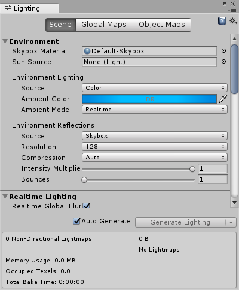
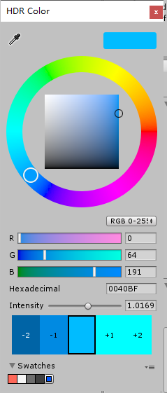
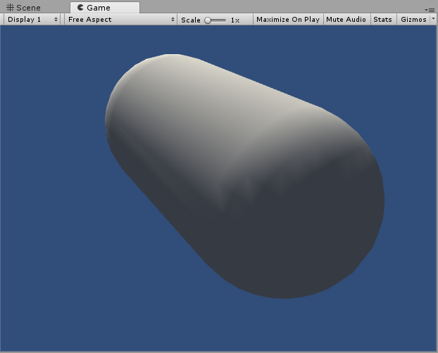
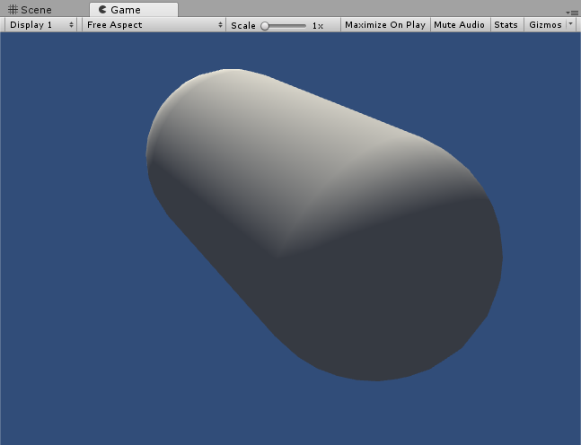
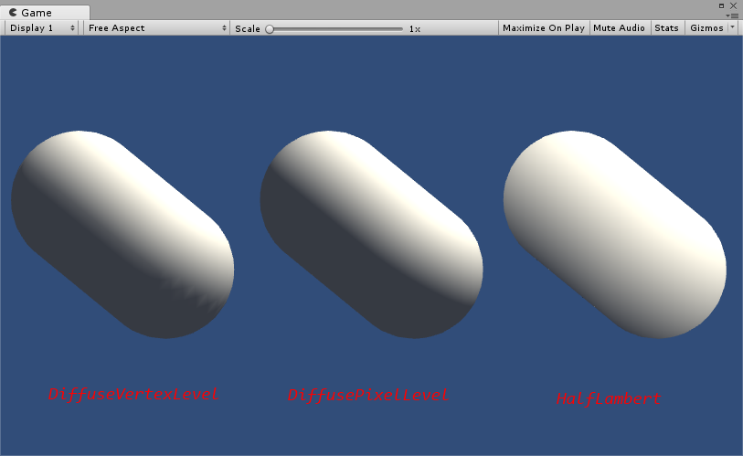
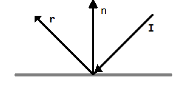

# 第6章 Unity中的基础光照

## 6.2 标准光照模型

虽然光照模型有很多种类，但在早期的游戏引擎中往往只使用一个光照模型，这个模型被称为标准光照模型。实际上，在BRDF理论被提出之前，标准光照模型就已经被广泛使用了。

在1975年，著名学者裴祥风（Bui Tuong Phong）提出了标准光照模型背后的基本理念。标准光照模型只关心直接光照（direct light），也就是那些直接从光源发射出来照射到物体表面后，经过物体表面的一次反射直接进入摄像机的光线。

它的基本方法是，把进入到摄像机内的光线分为4个部分，每个部分用一种方法来计算它的贡献度。这4个部分是：

- 自发光（emissive）部分，本书使用 $c_{emissive}$ 来表示。这个部分用于描述当给定一个方向时，一个表面本身会向该方向发射多少辐射量。需要注意的是，如果没有使用全局光照（global illumination）技术，这些自发光的表面并不会真的照亮周围的物体，而是它本身看起来更亮了而已。
- 高光反射（specular）部分，本书使用 $c_{specular}$ 来表示。这个部分用于描述当光线从光源照射到模型表面时，该表面会在完全镜面反射方向散射多少辐射量。
- 漫反射（diffuse）部分，本书使用 $c_{diffuse}$ 来表示。这个部分用于描述，当光线从光源照射到模型表面时，该表面会向每个方向散射多少辐射量。
- 环境光（ambient）部分，本书使用 $c_{ambient}$ 来表示。它用于描述其他所有的间接光照。

### 6.2.5 逐像素还是逐顶点

上面，我们给出了基本光照模型使用的数学公式，那么我们在哪里计算这些光照模型呢？通常来讲，我们有两种选择：在片元着色器中计算，也被称为逐像素光照（per-pixel lighting）；在顶点着色器中计算，也被称为逐顶点光照（per-vertex lighting）。

在逐像素光照中，我们会以每个像素为基础，得到它的法线（可以是对顶点法线插值得到的，也可以是从法线纹理中采样得到的），然后进行光照模型的计算。这种在面片之间对顶点法线进行插值的技术被称为Phong着色（Phong shading），也被称为Phong插值或法线插值着色技术。这不同于我们之前讲到的Phong光照模型。

与之相对的是逐顶点光照，也被称为高洛德着色（Gouraud shading）。在逐顶点光照中，我们在每个顶点上计算光照，然后会在渲染图元内部进行线性插值，最后输出成像素颜色。由于顶点数目往往远小于像素数目，因此逐顶点光照的计算量往往要小于逐像素光照。但是，由于逐顶点光照依赖于线性插值来得到像素光照，因此，当光照模型中有非线性的计算时（例如计算高光反射时），逐顶点光照就被出问题。在后面的章节中，我们将会看到这种情况。而且，由于逐顶点光照会在渲染图元内部对顶点颜色进行插值，这会导致渲染图元内部的颜色总是暗于顶点处的最高颜色值，这在某种情况下会产生明显的棱角现象。

### 6.2.6 总结

虽然标准光照模型仅仅是一个经验模型，也就是说，它并不完全符合真实世界中的光照现象。但由于它的易用性、计算速度和得到的效果都比较好，因此仍然被广泛使用。而也是由于它的广泛使用性，这种标准光照模型有很多不同的叫法。例如，一些资料中称它为 Phong 光照模型，因为裴祥风（Bui Tuong Phong）首先提出了使用漫反射和高光反射的和来对反射光照进行建模的基本思想，并且提出了基于经验的计算高光反射的方法（用于计算漫反射光照的兰伯特模型在那时已经被提出了）。而后，由于Blinn的方法简化了计算而且在某些情况下计算更快，我们把这种模型称为Blinn-Phong光照模型。

但这种模型有很多局限性。首先，有很多重要的物理现象无法用Blinn-Phong模型表现出来，例如菲涅耳反射（Fresnel reflection）。其次，Blinn-Phong模型是各向同性（isotropic）的，也就是说，当我们固定视角和光源方向旋这个表面时，反射不会发生任何改变。但有些表面是具有各向异性（anisotropic）反射性质的，例如拉丝金属、毛发等。在第18章中，我们将学习基于物理的光照模型，这些光照模型更加复杂，同时也可以更加真实地反映光和物体的交互。

## 6.3 Unity中的环境光和自发光

在标准光照模型中，环境光和自发光的计算是最简单的。

在Unity中，场景中的环境光可以在Window->Rendering->Lighting Settings->Ambient Source/Ambient Color/Ambient Intensity中控制，如图6.5所示。在Shader中，我们只需要通过Unity的内置变量UNITY_LIGHTMODEL_AMBIENT就可以得到环境光的颜色和强度信息。





而大多数物体是没有自发光特性的，因此在本书绝大部分的Shader中都没有计算自发光部分。如果要计算自发光也非常简单，我们只需要在片元着色器输出最后的颜色之前，把材质的自发光颜色添加到输出颜色上即可。

## 6.4 在Unity Shader中实现漫反射光照模型

在了解了上述的理论后，我们现在来看一下如何在Unity中实现这些基本光照模型。首先，我们来实现标准光照模型中的漫反射光照部分。

在6.2.3节中，我们给出了基本光照模型中漫反射部分的计算公式：

$$ c_{diffuse} = (c_{light} \cdot m_{diffuse}) \max (0, \hat n \cdot I) $$

从公式可以看出，要计算漫反射需要知道4个参数：入射光线的颜色和强度 $c_{light}$，材质的漫反射系数 $m_{diffuse}$，表面法线 $\hat n$ 以及光源方向 $I$。

为了防止点积结果为负值，我们需要使用`max`操作，而CG提供了这样的函数。在本例中，使用CG的另一个函数可以达到同样的目的，即`saturate`函数。

函数：`saturate(x)`
参数：x：为用于操作的标量或矢量，可以是float、float2、float3等类型。
描述：把x截取在\[0, 1\]范围内，如果x是一个矢量，那么会对它的每一个分量进行这样的操作。

### 6.4.1 实践：逐顶点光照

我们首先来看如何实现一个逐顶点的漫反射光照效果。在学习完本节后，我们会得到类似图6.6中的效果。



图6.6 逐顶点的漫反射光照效果

为此，我们进行如下准备工作。

1. 在Unity中新建一个场景。在本书资源中，该场景名为Scene_6_4.在Unity5.2中，默认情况下场景将包含一个摄像机和一个平行光，并且使用了内置的天空盒子。在Window->Lighting->Skybox中去掉场景中的天空盒子。
2. 新建一个材质。在本书资源中，该材质名为DiffuseVertexLevelMat。
3. 新建一个Unity Shader。在本书资源中，该Shader名为Chapter6-DiffuseVertexLevel。把新的Shader赋给第2步中创建的材质。
4. 在场景中创建一个胶囊体，并把第2步中的材质赋给该胶囊体。
5. 保存场景。

下面，我们需要编写自己的Shader来实现一个逐顶点的漫反射效果。打开第3步中创建的Unity Shader，删除所有已有代码，并进行如下修改。

```shaderlab
// Upgrade NOTE: replaced '_World2Object' with 'unity_WorldToObject'
// Upgrade NOTE: replaced 'mul(UNITY_MATRIX_MVP,*)' with 'UnityObjectToClipPos(*)'

//双引号里面是这个Shader的名字
Shader "Custom/DiffuseVertexLevel" {
    Properties {
        //为了得到并且控制材质的漫反射颜色，在Properties语义块中声明Color类型的属性，初始值设为白色。
        _Diffuse ("Diffuse", Color) = (1, 1, 1, 1)
    }
    SubShader {
        //在SubShader语义块中定义一个Pass语义块。这是因为顶点、片元着色器的代码需要写在Pass语义块，而非SubShader语义块中。
        Pass {
            //在Pass的第一行，指明了该Pass的光照模式
            //LightMode标签是Pass标签中的一种，它用于定义该Pass在Unity的光照流水线中的角色，在第9章中我们会更详细地解释它。在这里，我们只需要知道，只有定义了正确的LightMode，我们才能得到一些Unity的内置光照变量，例如下面要讲到的_LightColor0.
            Tags { "LightMode" = "ForwardBase" }
            //使用CGPROGRAM和ENDCG来包围CG代码片，以定义最重要的顶点着色器和片元着色器代码。
            CGPROGRAM
            //使用#pragma指令来告诉Unity，我们定义的顶点着色器和片元着色器叫什么名字。在本例中，它们的名字分别是vert和frag。
            #pragma vertex vert
            #pragma fragment frag
            //为了使用Unity内置的一些变量，如后面要讲到的_LightColor0，还需要包含进Unity的内置文件Lighting.cginc
            #include "Lighting.cginc"
            //为了在Shader中使用Properties语义块中声明的属性，我们需要定义一个和该属性类型相匹配的变量。
            //通过这样的方式，我们就可以得到漫反射公式中需要的参数之一——材质的漫反射属性。由于颜色属性的范围在0到1之间，因此可以使用fixed精度的变量来存储它。
            fixed4 _Diffuse;
            //定义顶点着色器的输入和输出结构体（输出结构体同时也是片元着色器的输入结构体）
            struct a2v {
                float4 vertex : position;
                //为了访问顶点的法线，需要定义一个normal变量，并通过使用NORMAL语义来告诉Unity要把模型顶点的法线信息存储到normal变量中。
                float3 normal : normal;
            };

            struct v2f {
                float4 pos : sv_position;
                //为了把在顶点着色器中计算得到的光照颜色传递给片元着色器，需要定义一个color变量。并不是必须使用COLOR语义，一些资料中会使用TEXCOORD0语义。
                fixed3 color : color;
            };

            v2f vert(a2v v) {
                v2f o;
                //把坐标点从对象空间转换到相机的齐次坐标裁剪空间。参考 https://docs.unity3d.com/Manual/SL-BuiltinFunctions.html
                o.pos = UnityObjectToClipPos(v.vertex);
                //获取环境光项
                fixed3 ambient = UNITY_LIGHTMODEL_AMBIENT.xyz;
                //把法线从对象空间转换到世界空间
                fixed3 worldNormal = normalize(mul(v.normal, (float3x3)unity_WorldToObject));
                //获取灯光在世界空间的方向
                fixed3 worldLight = normalize(_WorldSpaceLightPos0.xyz);
                //计算漫反射项
                fixed3 diffuse = _LightColor0.rgb * _Diffuse.rgb * saturate(dot(worldNormal, worldLight));
                //最终结果为环境光+漫反射
                o.color = ambient + diffuse;
                return o;
            }

            fixed4 frag(v2f i) : sv_target {
                return fixed4(i.color, 1.0);
            }
            ENDCG
        }
    }
    FallBack "Diffuse"
}

```

顶点着色器最基本的任务就是把顶点位置从模型空间转换到裁剪空间中。因此我们需要使用Unity内置的模型`世界投影矩阵` `UNITY_MATRIX_MVP` 来完成这样的坐标转换。接下来，通过Unity内置变量`UNITY_LIGHTMODEL_AMBIENT`得到环境光部分。

然后，就是真正计算漫反射光照的部分。回忆一下，为了计算漫反射光照我们需要知道4个参数。在前面的步骤中，我们已经知道了材质的漫反射颜色`_Diffuse`以及顶点法线`v.normal`。我们还需要知道光源的颜色和强度信息以及光源方向。Unity提供给我们一个内置变量`_LightColor0`来访问该Pass处理的光源的颜色和强度信息（注意，想要得到正确的值需要定义合适的`LightMode`标签），而光源方向可以由`_WorldSpaceLightPos0`来得到。需要注意的是，这里对光源方向的计算并不具有通用性。在本节中，我们假设场景中只有一个光源且该光源的类型是平行光。但如果场景中有多个光源并且类型可能是点光源等其他类型，直接使用`_WorldSpaceLightPos0`就不能得到正确的结果。我们将在6.6节中学习如何使用内置函数来处理更复杂的光源类型。

在计算法线和光源方向之间的点积时，我们需要选择它们所在的坐标系，只有两者处于同一坐标空间下，它们的点积才有意义。在这里，我们选择了世界坐标空间。而由`a2v`得到的顶点法线是位于模型空间下的，因此我们首先需要把法线转换到世界空间中。在4.7节中，我们已经知道可以使用顶点变换矩阵的逆转置矩阵对法线进行相同的变换，因此我们首先得到模型空间到世界空间的变换矩阵的逆矩阵`_World2Object`，然后通过调换它在`mul`函数中的位置，得到和转置矩阵相同的矩阵乘法。由于法线是一个三维矢量，因此我们只需要截取`_World2Object`的前三行前三列即可。

在得到了世界空间中的法线和光源方向后，我们需要对它们进行归一化操作。在得到它们点积的结果后，我们需要防止这个结果为负。为此，我们使用了`saturate`函数。saturate函数是CG提供的一种函数，它的作用是可以把参数截取到\[0, 1\]的范围内。最后，再与光源的颜色和强度以及材质的漫反射颜色相乘即可得到最终的漫反射光照部分。

最后，我们对环境光和漫反射光部分相加，得到最终的光照结果。

由于所有的计算在顶点着色器中都已经完成了，因此片元着色器的代码很简单，我们只需要直接把顶点颜色输出即可。

最后，我们需要把这个Unity Shader的回退shader设置为内置的Diffuse。

至此，我们已经详细解释了逐顶点的漫反射光照的实现。对于细分程度较高的模型，逐顶点光照已经可以得到比较好的光照效果了。但对于一些细分程度较低的模型，逐顶点光照就会出现一些视觉问题，例如我们可以在图6.6中看到在胶囊体的背光面与向光面交界处有一些锯齿。为了解决这些问题，我们可以使用逐像素的漫反射光照。

### 6.4.2 实践：逐像素光照

我们只需要对Shader进行一些更改就可以实现逐像素的漫反射效果，如图 6.7 所示。



图6.7 逐像素的漫反射光照效果

为此，我们进行如下的准备工作。

1. 使用6.4.1节中使用的场景。
2. 新建一个材质。在本书资源中，该材质名为DiffusePixelLevelMat。
3. 新建一个Unity Shader。在本书资源中，该Shader名为Chapter6-DiffusePixelLevel。把新的Shader赋给第2步中创建的材质。
4. 把第2步中创建的材质赋给胶囊体。

Chapter6-DiffusePixelLevel的代码和6.4.1小节中的非常相似，因此我们首先把6.4.1节中的代码直接粘贴到Chapter6-DiffusePixelLevel中，并进行如下修改。完整代码如下。

```shaderlab
// Upgrade NOTE: replaced '_World2Object' with 'unity_WorldToObject'
// Upgrade NOTE: replaced 'mul(UNITY_MATRIX_MVP,*)' with 'UnityObjectToClipPos(*)'

Shader "Custom/DiffusePixelLevel" {
    Properties {
        _Diffuse ("Diffuse", Color) = (1, 1, 1, 1)
    }
    SubShader {
        Pass {
            Tags { "LightMode" = "ForwardBase" }
            CGPROGRAM
            #pragma vertex vert
            #pragma fragment frag
            #include "Lighting.cginc"

            fixed4 _Diffuse;

            struct a2v {
                float4 vertex : POSITION;
                float3 normal : NORMAL;
            };

            struct v2f {
                float4 pos : SV_POSITION;
                float3 worldNormal : TEXCOORD0;
            };
            //顶点着色器不需要计算光照模型，只需要把世界空间下的法线传递给片元着色器即可。
            v2f vert(a2v v) {
                v2f o;
                o.pos = UnityObjectToClipPos(v.vertex);
                o.worldNormal = normalize(mul(v.normal, (float3x3)unity_WorldToObject));
                return o;
            }
            //在片元着色器中计算漫反射光照模型
            fixed4 frag(v2f i) : SV_TARGET {
                fixed3 ambient = UNITY_LIGHTMODEL_AMBIENT.xyz;
                fixed3 worldLightDir = normalize(_WorldSpaceLightPos0.xyz);
                fixed3 diffuse = _LightColor0.rgb * _Diffuse.rgb * saturate(dot(i.worldNormal, worldLightDir));
                fixed3 color = ambient + diffuse;
                return fixed4(color, 1.0);
            }
            ENDCG
        }
    }
    FallBack "Diffuse"
}

```

逐像素光照可以得到更加平滑的光照效果。但是，即便使用了逐像素漫反射光照，有一个问题仍然存在。在光照无法到达的区域，模型的外观通常是全黑的，没有任何明暗变化，这会使模型的背光区域看起来就像一个平面一样，失去了模型细节表现。实际上我们可以通过添加环境光来得到非全黑的效果，但即便这样仍然无法解决背光面明暗一样的缺点。为此，有一种改善技术被提出来，这就是**半兰伯特（Half Lambert）光照模型**。

### 6.4.3 半兰伯特模型

在6.4.1小节中，我们使用的漫反射光照模型也被称为兰伯特光照模型，因为它符合兰伯特定律——在平面某点漫反射光的光照与该反射点的法向量和入射光角度的余弦值成正比。为了改善6.4.2小节最后提出的问题，Valve公司在开发游戏《半条命》时提出了一种技术，由于该技术是在原兰伯特光照模型上进行了一个简单的修改，因此被称为半兰伯特光照模型。

广义的半兰伯特光照模型的公式如下：

$$ c_{diffuse}=(c_{light} \cdot m_{diffuse})(\alpha(\hat n \cdot I)+\beta) $$

可以看出，与原兰伯特模型相比，半兰伯特光照模型没有使用 max 操作来防止 $\hat n$ 和 $I$ 的点积为负值，而是对其结果进行了一个 $\alpha$ 倍的缩放再加上一个 $\beta$ 大小的偏移。绝大多数情况下， $\alpha$ 和 $\beta$ 的值均为0.5，即公式为：

$$ c_{diffuse}=(c_{light} \cdot m_{diffuse})(0.5(\hat n \cdot I)+0.5) $$

通过这样的方式，我们可以把 $\hat n \cdot I$ 的结果范围从\[-1, 1\]映射到\[0, 1\]范围内。也就是说，对于模型的背光面，在原兰伯特光照模型中点积结果将映射到同一个值，即0值处；而在半兰伯特模型中，背光面也可以有明暗变化，不同的点积结果将会映射到不同的值上。

需要注意的是，半兰伯是没有任何物理依据的，它仅仅是一个视觉加强技术。

对 6.4.2 小节中得到的代码做一些修改就可以实现半兰伯特漫反射光照效果。

1. 仍然使用6.4.1小节中使用的场景。
2. 新建一个材质。在本书资源中，该材质名为HalfLambertMat。
3. 新建一个Unity Shader。在本书资源中，该Shader名为Chapter6-HalfLambert。把新的Shader赋给第2步中创建的材质。
4. 把第2步中创建的材质赋给胶囊体。

复制DiffusePixelLevel的Shader代码，并修改片元着色器中计算漫反射光照的部分，具体代码如下：

```shaderlab
// Upgrade NOTE: replaced '_World2Object' with 'unity_WorldToObject'
// Upgrade NOTE: replaced 'mul(UNITY_MATRIX_MVP,*)' with 'UnityObjectToClipPos(*)'

Shader "Custom/HalfLambert" {
    Properties {
        _Diffuse ("Diffuse", Color) = (1, 1, 1, 1)
    }
    SubShader {
        Pass {
            Tags { "LightMode" = "ForwardBase" }
            CGPROGRAM
            #pragma vertex vert
            #pragma fragment frag
            #include "Lighting.cginc"

            fixed4 _Diffuse;

            struct a2v {
                float4 vertex : POSITION;
                float3 normal : NORMAL;
            };

            struct v2f {
                float4 pos : SV_POSITION;
                float3 worldNormal : TEXCOORD0;
            };
            //顶点着色器不需要计算光照模型，只需要把世界空间下的法线传递给片元着色器即可。
            v2f vert(a2v v) {
                v2f o;
                o.pos = UnityObjectToClipPos(v.vertex);
                o.worldNormal = normalize(mul(v.normal, (float3x3)unity_WorldToObject));
                return o;
            }
            //在片元着色器中计算漫反射光照模型
            fixed4 frag(v2f i) : SV_TARGET {
                fixed3 ambient = UNITY_LIGHTMODEL_AMBIENT.xyz;
                fixed3 worldLightDir = normalize(_WorldSpaceLightPos0.xyz);
                fixed halfLambert = 0.5 * dot(i.worldNormal, worldLightDir) + 0.5;
                fixed3 diffuse = _LightColor0.rgb * _Diffuse.rgb * halfLambert;
                fixed3 color = ambient + diffuse;
                return fixed4(color, 1.0);
            }
            ENDCG
        }
    }
    FallBack "Diffuse"
}

```

图6.8给出了逐顶点漫反射光照、逐像素漫反射光照和半兰伯特光照的对比效果。



图 6.8 逐顶点漫反射光照、逐像素漫反射光照和半兰伯特光照的对比

## 6.5 在Unity Shader中实现高光反射光照模型

在6.2.4节中，我们给出了基本光照模型中高光反射部分的计算公式：

$$ c_{specular} = (c_{light} \cdot m_{specular})\max(0, \hat v \cdot r)^{m_{gloss}} $$

从公式可以看出，要计算高光反射需要知道4个参数：入射光线的颜色和强度$c_{light}$，材质的高光反射系数$m_{specular}$，视角方向$\hat v$以及反射方向$r$。其中，反射方向$r$可以由表面法线$\hat n$和光源方向$\hat I$计算而得：

$$ r = \hat I - 2(\hat n \cdot \hat I)\hat n $$

上述公式很简单，更幸运的是，CG提供了计算反射方向的函数 reflect。

函数：reflect(i, n)

参数：i，入射向量；n，法线向量。可以是float、float2、float3等类型。

描述：当给定入射方向i和法线方向n时，reflect函数可以返回反射方向。图6.9给出了参数和返回值之间的关系。



图 6.9 CG的reflect函数

公式推导可以参考blog：[求反射向量](https://www.cnblogs.com/graphics/archive/2013/02/21/2920627.html)

小提示：这里的入射与反射都是针对表面交点来说的。所以入射光线是从光源方向指向表面交点。反射光线则是从表面交点指向外部。
