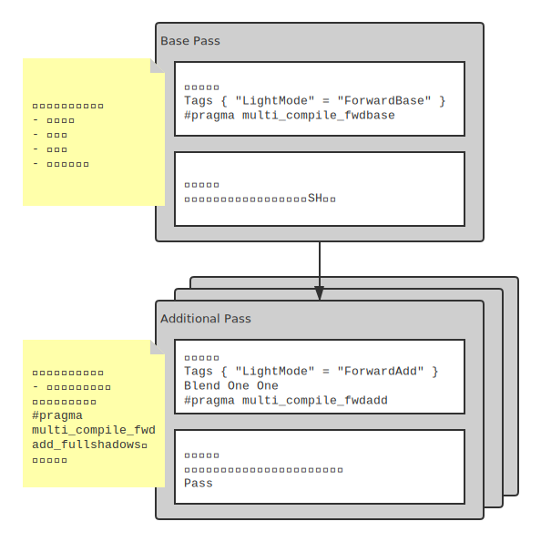

# 第9章 更复杂的光照

1. 能处理平行光之外的其它类型的光源；
2. 得到阴影；

## 9.1 Unity的渲染路径

渲染路径（Rendering Path）决定了光照是如何应用到Unity Shader中的。只有给每个Pass指定渲染路径，Unity才能提供光源和处理后的光照信息数据。

可以对Camera组件设置单独的Rendering Path。优先级就会比Project Settings里的Rendering Path高。

在每个Pass的Tags定义里指定LightMode的标签，就可以指定该Pass使用的渲染路径。

```shaderlab
Pass {
    Tags { "LightMode" = "ForwardBase" }
}
```

LightMode标签支持的渲染路径选项：

| 标签名 | 描述 |
| - | - |
| Always | 不管使用哪种渲染路径，该Pass总是会被渲染，但不会计算任何光照 |
| ForwardBase | 用于前向渲染。该Pass会计算环境光、最重要的平行光、逐顶点/SH光源和Lightmaps |
| ForwardAdd | 用于前向渲染。该Pass会计算额外的逐像素光源，每个Pass对应一个光源 |
| Deferred | 用于延迟渲染。该Pass会渲染到G缓冲区（G-Buffer） |
| ShadowCaster | 把物体的深度信息渲染到阴影映射纹理（shadowmap）或一张深度纹理中 |
| PrepassBase | 用于遗留的延迟渲染。略 |
| PrepassFinal | 用于遗留的延迟渲染。略 |
| Vertex、VertexLM、VertexLMRGBM | 用于遗留的顶点照明渲染。略 |

### 9.1.1 前向渲染路径

每进行依次完整的前向渲染，需要渲染该对象的渲染图元，并计算两个缓冲区的信息： 1. 颜色缓冲区； 2. 深度缓冲区。利用深度缓冲区来决定一个片元是否可见，如果可见就更新颜色缓冲区的颜色。伪代码如下：

```
foreach (triangle in model) {
    foreach (fragment covered by triangle) {
        if (IsDepthTestFail()) {
            discard;
        } else {
            float4 color = ShadingFunction(materialInfo, pos, ...);
            UpdateFrameBuffer(fragment, color);
        }
    }
}
```

对每个逐像素光源，都需要进行上面一次完整的渲染流程。如果一个物体在多个逐像素光源的影响区域内，那么该物体就需要执行多个Pass，每个Pass计算一个逐像素光源的光照结果。然后在帧缓冲区中把光照结果混合起来得到最终的颜色值。假设场景中有N个物体，每个物体受M个光源影响，那么要渲染整个场景一共需要N*M个Pass。如果有大量的逐像素光照，那么需要执行大量的Pass。因此渲染引擎会限制每个物体的逐像素光照的数目。

在前向渲染路径中，照亮物体的方式一共有3种：

1. 逐顶点；
2. 逐像素；
3. 球谐函数；

光源的类型（Point、Directional、Spot）和渲染模式（Auto、Important、Not Important）决定了这个光源使用的照亮方式。



表 9.2 前向渲染可以使用的内置光照变量：

| 变量名 | 类型 | 描述 |
| - | - | - |
| _LightColor0 | float4 | 该Pass处理的逐像素光源的颜色 |
| _WorldSpaceLightPos0 | float4 | 如果是平行光，那么w分量是0，xyz分量指示平行光的方向。如果是其他类型的灯光，那么w分量是1，xyz分量是该Pass处理的逐像素光源的位置。 |
| _LightMatrix0 | float4x4 | 从世界空间到光源空间的变换矩阵。可以用于采样cookie和光强衰减纹理。 |
| unity_4LightPosX0, unity_4LightPosY0, unity_4LightPosZ0 | float4 | 仅用于Base Pass。存储了前4个非重要的点光源在世界空间中的位置。 |
| unity_4LightAtten0 | float4 | 仅用于Base Pass。存储了前4个非重要的点光源的衰减因子。 |
| unity_LightColor | half4[4] | 仅用于Base Pass。存储了前4个非重要的点光源的颜色。 |

表 9.3 前向渲染可以使用的内置光照函数：

| 函数名 | 描述 |
| - | - |
| float3 WorldSpaceLightDir(float4 v) | 仅用于前向渲染。输入一个模型空间中的顶点位置，返回世界空间中从该点到光源的光照方向。内部实现使用了UnityWorldSpaceLightDir函数。没有被归一化。 |
| float3 UnityWorldSpaceLightDir(float4 v) | 仅用于前向渲染。输入一个世界空间中的顶点位置，返回世界空间中从该点到光源的光照方向。没有被归一化。 |
| float3 ObjSpaceLightDir(float4 v) | 仅用于前向渲染。输入一个模型空间中的顶点位置，返回模型空间中从该点到光源的光照方向。没有被归一化。 |
| float3 Shade4PointLights(...) | 仅用于前向渲染。它的参数是已经打包进矢量的光照数据，通常就是unity_4LightPosX0, unity_4LightPosY0, unity_4LightPosZ0, unity_LightColor 和 unity_4LightAtten0等。前向渲染通常使用这个函数来计算逐顶点光照。 |

## 9.2 Unity的光源类型

Unity一共支持4种光源类型：

1. 平行光；
2. 点光；
3. 聚光；
4. 面光（仅烘焙时可用）；

### 9.2.1 光源类型有什么影响

shader中使用光源的主要属性有：

* 位置
* 方向
* 颜色
* 强度
* 衰减

这些属性与光源的几何定义息息相关。

#### 9.2.1.1 平行光

平行光的照亮范围没有限制。平行光到场景中任何一点的方向都是一样的。平行光无衰减。

* 位置：可以摆放在场景中的任何位置；
* 方向：Transform组件的Rotation属性决定平行光的方向；
* 衰减：无

#### 9.2.1.2 点光

点光的照亮空间有限，由空间中的一个球体定义其照亮范围。点光表示一个由一个点发出的、向所有方向延伸的光。

* 位置：Transform.position
* 方向：从某点到点光源的位置
* 衰减：球心处光强最强，球体边界及球外的强度为0，中间处由函数定义。

#### 9.2.1.3 聚光

聚光照亮的范围是一个圆锥体区域，圆锥体张开的角度由SpotAngle定义（范围为[1, 179]），圆锥体的高则是由Range属性定义。

* 位置：Transform.position
* 方向：从某点到聚光源的位置。
* 衰减：在圆锥体顶点处光照强度最强，在锥体的边界处以及锥体外的强度为0，中间处由函数定义。此函数比点光衰减函数更复杂。

### 9.2.2 在前向渲染中处理不同的光源类型

