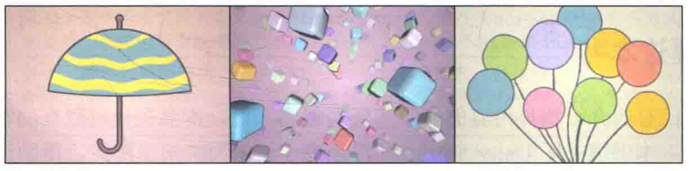

# 前言

2004年，有3位年轻人在开发他们的第一款游戏失利后，决定在丹麦首都哥本哈根建立一家游戏引擎公司。最初，他们的想法是要让全世界的开发人员可以使用最少的资源来创建出他们喜欢的游戏。谁也不曾想到，十年以后，这个起初并不起眼的公司已经发展成为游戏引擎公司巨头，而他们的游戏引擎也成为世界上应用最广泛的游戏引擎。没错，这个公司就是Unity Technologies，这3位年轻人分别是公司创始人David Helgason（CEO）、Nicholas Francis（CCO）和Joachim Ante（CTO）。而这3位创始人的初衷也得以实现，截止到2014年，全世界有超过300多万的开发者在使用游戏引擎Unity来开发游戏，更有6亿玩家在玩由Unity引擎制作的游戏。这股“Unity热”一直持续到现在。

虽然Unity引擎上手快，操作界面简单快捷，但许多Unity开发者却发现，当他们需要在Unity中实现一些特殊的画面效果时，往往无从下手。这些画面效果的实现通常和渲染有关，更具体来说，我们通常需要在Unity中编写一些Unity Shader文件来实现它们。一方面，对渲染知识的缺乏和对Shader的不了解导致很多开发者在这条路上举步维艰；另一方面，对游戏画面的提升是越来越多游戏公司的诉求。然而，Unity官方文档中不仅缺少对渲染原理讲解的内容，对Unity Shader本身的一些工作机制（概括来说，Unity Shader是Shader上层的一个抽象）同样缺少相关资料。同时，市面上能适应初学者的Unity Shader书少之又少。基于这些原因，使得我想要编写这样一本书来帮助开发者渡过困境。

本书旨在从基础开始，帮助读者逐渐了解并掌握如何编写Unity Shader。本书不仅仅是要教会读者“如何使用Unity Shader”，更重要的是要帮助读者建立对渲染流程的基本认识，在此基础上，帮助读者学习Unity中的一些渲染机制以及如何使用Unity Shader实现各种自定义的渲染效果。我相信，让读者首先了解原理再进行实践，相比于大量堆砌代码是更好的学习方法。因此，本书在开始实践前，均会为读者讲解大量的原理，让读者在学习时不再一头雾水。

尽官本书专注于学习Unity Shader，但根据我的学习经验来看，在不了解基础的渲染流程和基本的数学知识前，想要深入学习Shader的编写是非常困难的。实际上，Shader仅是整个渲染流程的一个子部分，因此，任何脱离渲染流程的对Shader的讲解可能会让读者更加困惑。而向量运算、矩阵变换等数学知识在Shader的编写中无处不在，因此，这些数学知识往往也是让初学者对Shader望而却步的原因。基于上面的两点观察，本书的安排从易到难，由基础到深入。我们把全书分为了5篇，读者可以在第1章中看到这些章节的具体安排。

随着硬件的发展，Shader的能力也越来越大。如果问你，一个Shader可以做什么？你可能会回答渲染游戏模型、模拟波动的海面、实现各种屏幕特效等。但如果告诉你，上面所示的3张图片完全依靠一个片元着色器来渲染实现，没有借助任何外部模型和纹理，你可能会觉得非常不可思议！读者可以在Shadertoy网站上看到许多这样的例子。例如，上面的小雨伞、五彩的小方块，以及飘动的气球（由于本书是黑白印刷，一些效果无法显现）。一个简简单单的Shader可以做到什么程度的效果，我们已经不可预期。本书的重点不在于教读者如何单纯使用Shader来实现上面的效果，而在于如何让Shader和其他游戏开发元素（例如，模型、纹理、脚本等）相配合，实现游戏中常见的渲染效果，我们在此只想说明Shader可能远比你想象的要强大得多。我们真诚地希望本书可以带领读者走进Shader的世界，让读者理解Shader、掌握Shader，和我们一起享受这样一个奇妙的游戏开发世界！

## 读这本书之前你需要哪些知识

本书面向Unity Shader初学者和程序员，尽量在本书的基础篇中介绍那些必要的基础知识，但仍然希望读者可以具备如下知识。

- 有一定（或少量）的编程经验。尽管Unity Shader的编写 语言不同于C++、C#这种高级语言，但相比于完全没有编程经验的读者来说，学习过这些高级语言的读者更加容易理解Shader的代码。例如，什么是变量、什么是函数等。对于那些缺少编程经验但仍对Shader有浓厚兴趣的读者，一个好消息是，在Unity的帮助下，编写Unity Shader的代码量并不多，因此，这些读者仍然可以阅读本书。
- 对Unity引擎的操作界面比较熟悉。假定读者曾使用过一段时间的Unity，对其中的 一些基本操作已经掌握。例如，如何创建场景、脚本和游戏对象等。
- 保持一定的耐心。我曾听到身边的一些朋友抱怨，为什么自己总是看不懂、学不会Shader，难道是自己学习能力有问题吗？实际上，这些朋友大多对Shader的学习缺乏耐心，总是抱着今天看一下明天就会的心情。但不幸的是，与C++、C#高级语言相比来说，就算我们成功编写了Shader版的“Hello world”，但对于为什么要这么写、它们是怎么执行的等一系列基础问题我们仍然并不理解。这正是我之前提到的，要想彻底理解Shader，就必须了解整个渲染流水线的工作方式。因此，保持耐心，打好基础，是每一个想要深入学习Shader的开发者的必经之路。
- 有一定的数学基础，包括了解基本的代数运算（如结合律、交换律等）、三角运算（如正弦、余弦计算等）。除此之外，如果读者具有大学水平的线性代数、微积分等数学知识，会发现阅读本书时会更加容易。为了帮助读者学习Shader中常见的数学运算，我们专门在本书的第4章为读者介绍向量、矩阵、空间变换等重要的数学内容。

如果你满足上面几点小小的条件，那么恭喜你，现在你可以安心地继续阅读本书了！

## 谁适合读这本书

任何想要了解渲染基础或想要自由地使用Unity Shader编写渲染效果的开发者均可阅读本书。这些开发者不仅限于进行游戏开发的程序员，也包括那些渴望更加自由地在Unity中实现各种画面效果的美术人员、在校学生和爱好者等。

## 为什么你需要这本书

与国内市场已有的介绍相关内容的书籍和资料相比来说，本书有一些独有的特色。

- 内容独特。本书填补了Unity Shader
